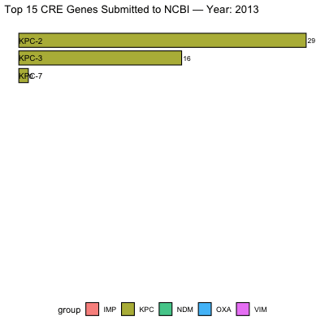

<script src="index_files/kePrint/kePrint.js"></script>
<link href="index_files/lightable/lightable.css" rel="stylesheet" />

> Learnt major carbapenemase genes (KPC, NDM, OXA) using NCBI isolate data and molecular dynamics. Includes gene frequency trends, co-resistance patterns, and MM/PBSA binding comparisons of avibactam with KPC vs NDM to illustrate mechanistic differences 🧬

## Motivations:
We've previously learnt about [ESBL genes](https://www.kenkoonwong.com/blog/amr/) and took a peek under the hood of the nucleotides and explore NCBI library and assess their frequency. Why not let's pick another AMR gene and learn! Let's explore Carbapenemase producing organisms! In this blog, we'll spare you the code, as we basically use the same workflow previous, change a few search keys and variables and out comes the result! 

## Objectives:
- [Which are carbapenemase producing genes?](#genes)
- [How are we going to do this?](#how)
- [Results](#results)
  - [The Proportion of Carbapenemase producing Genes in Meropenem Resistant Organism](#noncre)
  - [The Frequency of Carbapanemase Genes](#freq)
  - [Visualize Carbapanemase Gene Frequency By Year](#anim)
  - [Do MBLs Frequently Have Co-resistance Of Other Carbapenamase?](#coresistant)
  - [Let's Take a Look At Avibactam-KPC and Avibactam-NDM Molecular Dynamic Simulation](#mdsim)
- [Opportunities for improvement](#opportunities)
- [Lessons learnt](#lesson)

## Which Are Carbapenemase Producing Genes? {#genes}
These are the major carbapanemase:    
class A - KPC.    
class B Metallo-B-lactamases (MBLs) - NDM, VIM, IMP.    
class D - OXA-48, OXA-181, OXA-232, OXA-244.    

Carbapenemases are classified into three molecular classes based on their hydrolytic mechanism. Class A & D carbapenemases all utilizing a serine-based active site. Class B MBLs rely on zinc in their active site. This is interesting, because while Avibactam was developed to have activities against Class A, C, and D beta-lactamases. However, it does not work on Class B! 😵‍💫 Hence, before susceptibility result is back, knowing which carbapenemase exists would be ideal. In fact the NG-Test CARBA 5 (also called "Carba 5") is a rapid immunochromatographic lateral flow assay that detects and differentiates the five most common carbapenemase families: KPC, NDM, VIM, IMP, and OXA-48-like. I heard it takes about 15 minutes to run one colony.

<p align="center">
  
</p>

Interesting thing on MBL-producing Enterobacterales, the IDSA recommends either `ceftazidime-avibactam + aztreonam` combination therapy or `cefiderocol monotherapy`. The rationale for the combination is that aztreonam (a monobactam) is stable against metallo-β-lactamases, while avibactam inhibits the serine β-lactamases (ESBLs, AmpC, KPC, OXA-48-like) that frequently co-exist in MBL-producing organisms and would otherwise hydrolyze aztreonam.

## How Are We Going To Do This? {#how}
Well, first of all, let's get all NCBI bacterial isolates fasta with meropenem resistance [here](https://www.ncbi.nlm.nih.gov/pathogens/isolates/#). Then download all carbapenemase producing genese, [here](https://www.ncbi.nlm.nih.gov/pathogens/refgene/#), then insert this `gene_family:(blaKPC blaNDM blaVIM blaIMP blaOXA-48 blaOXA-181 blaOXA-232 blaOXA-244)` to the filter. 

Then, run through the code we had previously [here](https://www.kenkoonwong.com/blog/amr/#allin), assess exact match and visualize the frequency just like before! Assess what are the proportions of these fastas do not match our carbapenemase producing genes, as not all meropenem resistance is due to beta lactamases, some could be due to porin loss, overexpression of efflux pump, ESBL + porin loss, AmpC + porin loss! 

After that, let's visualize the distribution based on the submission dates.

Remember we mentioned that with MBLs we either need to use combination therapy of aztreonam + ceftaz/avibactam or cefidericol monotherapy due to co-existence of other resistance? Let's take a look at all MBLs and see what other carbapenemase genes co-exist! 

Lastly, lets test out our molecular dynamic experiment on KPC and NDM with avibactam! We should see a strong binding affinity for KPC and a very weak binding affinity for NDM! We're going to include another post-simulation process called MM/PBSA and MM/GBSA as well. What that does it calculates the binding free energy of the ligand to the protein. The more negative the value, the stronger the binding affinity. This is a great way to quantify our results from our simulation and compare between different simulations!

## Results {#carba}
### The Proportion of Carbapenemase producing Genes in Meropenem Resistant Organism? {#noncre}

We have a total of 1027 isolates, and 45.86% have detected carbapenamase genes! That's with exact match, I did not check for low level mismatches.  

### The Frequency of Carbapanemase Genes {#freq}

}}index_files/figure-html/unnamed-chunk-2-1.png" width="672" />

Wow, NDM-1 is at the top? I've always thought KPCs is more frequent. Note, these are the sequences that were submitted to NCBI, not necessarily resembling the actual distribution in the real world. But still, interesting to see that NDM-1 is more frequently submitted than KPCs. 


### Visualize Carbapanemase Gene Frequency By Year {#anim}


<p align="center">
  
</p>

Looking at the above, KPCs submissions were dominating up until 2018. In 2019, NDM-1 started to creep up to top 1. Since then, NDM-1 remained number one until 2025. 

### Do MBLs Frequently Have Co-resistance Of Other Carbapenamase? {#coresistant}


<table>
 <thead>
  <tr>
   <th style="text-align:left;"> primary_gene </th>
   <th style="text-align:left;"> gene </th>
   <th style="text-align:right;"> n </th>
  </tr>
 </thead>
<tbody>
  <tr>
   <td style="text-align:left;"> NDM-1 </td>
   <td style="text-align:left;"> OXA-48 </td>
   <td style="text-align:right;"> 13 </td>
  </tr>
  <tr>
   <td style="text-align:left;"> NDM-5 </td>
   <td style="text-align:left;"> OXA-48 </td>
   <td style="text-align:right;"> 12 </td>
  </tr>
  <tr>
   <td style="text-align:left;"> NDM-1 </td>
   <td style="text-align:left;"> OXA-232 </td>
   <td style="text-align:right;"> 5 </td>
  </tr>
  <tr>
   <td style="text-align:left;"> NDM-5 </td>
   <td style="text-align:left;"> OXA-181 </td>
   <td style="text-align:right;"> 5 </td>
  </tr>
  <tr>
   <td style="text-align:left;"> NDM-5 </td>
   <td style="text-align:left;"> OXA-232 </td>
   <td style="text-align:right;"> 2 </td>
  </tr>
  <tr>
   <td style="text-align:left;"> NDM-7 </td>
   <td style="text-align:left;"> OXA-232 </td>
   <td style="text-align:right;"> 2 </td>
  </tr>
  <tr>
   <td style="text-align:left;"> NDM-1 </td>
   <td style="text-align:left;"> NDM-4 </td>
   <td style="text-align:right;"> 1 </td>
  </tr>
  <tr>
   <td style="text-align:left;"> NDM-1 </td>
   <td style="text-align:left;"> VIM-1 </td>
   <td style="text-align:right;"> 1 </td>
  </tr>
  <tr>
   <td style="text-align:left;"> NDM-1 </td>
   <td style="text-align:left;"> VIM-2 </td>
   <td style="text-align:right;"> 1 </td>
  </tr>
</tbody>
</table>

Interestingly when we look at MBL with co-resistance, it's usually OXA-48 and OXA-48-like! But, when looking at all the MBLs (n=257) that were submitted, co-resistance with OXA is only 15.18% (n=39). There were 3 NDMs with another MBL. That makes sense to combine aztreonam and ceftaz/avibactam to counter OXA-48 beta lactamase. Note that we did not include ESBLs, ampC on our search. 

### Let's Take a Look At Avibactam-KPC and Avibactam-NDM Molecular Dynamic Simulation {#mdsim}

We'll use the same pipeline as before, but this time we'll add Molecular Mechanic / PBSA. 

#### Installation

``` bash
conda create -n gmxpbsa -c conda-forge gmx_mmpbsa ambertools
conda activate gmxpbsa
```

#### Write `mmpbsa.in`
You can use `nano` or `nvim`, then paste the below

``` bash
&general
   startframe=1,
   endframe=500,
   interval=5,
   verbose=2,
/
&pb
   istrng=0.150,
   fillratio=4.0,
   inp=1,
   radiopt=0,
/
```

> Note: Make sure to change the startframe and endframe to where the the protein rmsd and ligand rmsd is stable. Essentially sampling from the stable portion of the simulation.

When running MM/GBSA use the parameters below, maybe name is `mmgbsa.in`

``` bash
&general
  startframe = 1,
  endframe = 500,
  interval = 1,
  verbose = 1,
  keep_files = 0,
/
&gb
  igb = 5,
  saltcon = 0.15,
/
```

#### To Run MM/PBSA or MM/GBSA

``` bash
gmx_MMPBSA \
  -O \
  -i mmpbsa.in \
  -cs md.tpr \
  -ct md_noPBC.xtc \
  -ci index.ndx \
  -cg 1 13 \
  -cp topol.top \
  -o FINAL_RESULTS.dat \
  -eo FINAL_RESULTS.csv
```


> Note: Make sure to write our regular pipeline first, create index etc, and leave the MM/PBSA or MM/GBSA until last.

Equation of the bond:
Delta G_bind = Delta G_gas + Delta G_solv
Where: 
Delta G_gas = gas-phase molecular mechanics energy (bonds, angles, dihedrals, van der Waals, electrostatics) `BOND+ANGLE+DIHED+VDWAALS+EEL+1-4 VDW+1-4 EEL`
Delta G_solv = solvation free energy (how the molecule interacts with the surrounding water) `EPB+ENPOLAR`

> Note: when you read the FINAL_RESULTS.csv, go to the last section, that's the delta. Total = sum of all the columns except Total. Negative == 👍

#### KPC181-Avibactam


}}index_files/figure-html/unnamed-chunk-13-1.png" width="1152" />}}index_files/figure-html/unnamed-chunk-13-2.png" width="1152" />}}index_files/figure-html/unnamed-chunk-13-3.png" width="1152" />}}index_files/figure-html/unnamed-chunk-13-4.png" width="1152" />}}index_files/figure-html/unnamed-chunk-13-5.png" width="1152" />

Alright, with the above, we have RMSD plateaud at around 20ns and RMSD ligand is pretty good and stable as well. Along with good H bonds and interaction energy, and reducing and converged minimal distance between protein and ligand and also distance between center of protein and ligand reduced and stablized as well. Let's visualize the first frame and last frame to ensure before we run MM/PBSA and MM/GBSA.

<p align="center">
  
</p>

Looks convincing! Let's take a look at MM/PBSA and MM/GBSA.

}}index_files/figure-html/unnamed-chunk-14-1.png" width="672" />

Alright, we have quite a few columns in facets here, but most are not helpful since we have 0 data mainly because we used inp=1. But total binding energy is negative, which is good! You can see that on the TOTAL. The median (IQR) is -8.07(-16.79 - -1.29). Now what about GBPA ?


}}index_files/figure-html/unnamed-chunk-15-1.png" width="672" />

And the Median Total (IQR) is `-10.615(-19.84 - -3.38)` . Not too shabby! 

#### NDM1-Avibactam
}}index_files/figure-html/unnamed-chunk-16-1.png" width="1152" />}}index_files/figure-html/unnamed-chunk-16-2.png" width="1152" />}}index_files/figure-html/unnamed-chunk-16-3.png" width="1152" />}}index_files/figure-html/unnamed-chunk-16-4.png" width="1152" />}}index_files/figure-html/unnamed-chunk-16-5.png" width="1152" />

RMSD ligand seems quite big, hbond is intermittent, one of interaction energy crosses zero, the min distance variance is quite wide towards the end of simulation. From these numbers, it looked like it did not bind well, which is expected since avibactam does not work on MBLs. Let's see visualize.

<p align="center">
  
</p>

Wow, they're not in the same position! It completely flipped! Usually in this setting, we shouldn't need to perform MM/PBSA. But what if we did?

}}index_files/figure-html/unnamed-chunk-17-1.png" width="672" />

Wow, even though looking at TOTAL the median is in the negative, but you see significant fluctuations (large variance) with lots of zeros! Compare this to our previous MM/PBSA and MM/GBSA, you can see the difference! 

What is interesting is that, I would imagine the ligand would have drifted away but it didn't. Let's investigate.

<p align="center">
  
</p>

I think the ligand is stuck in the pocket as the protein was undergoing conformational change and stabilized after ~30ns, and I think it may have trapped the ligand in the pocket, hence it didn't drift out of the pocket. I think 🤔 . Also, take note that the early simulation animation was without surface (only atoms), whereas the later one did have surface. With the matched protein and ligand of frame 0 and last frame proved that the initial pose was not optimal. 

There you have it! 

> Note: While MM/PBSA provides relative binding estimates, these simulations do not capture full enzymatic hydrolysis dynamics and should be interpreted as comparative rather than absolute


## Opportunities for improvement {#opportunities}
- need to learn ampC, porin loss, and other MDR genes
- need to test our MM/PBSA and MM/GBSA more, adjust isp=2 and see how they look like
- need to find a proper way to interpret/assess alphafold proteins prediction, which is considered good, which isn't, and how to deal with them
- need to dive into the math, physics, and organic chemistry of these simulations.
- need to do replicates of 3, report seeds, and also include 2 other similar coordinate poses with high scores.
- need to learnt covalent docking 


## Lessons Learnt {#lesson}
- learnt carbapenemase genes
- learnt MBLs may contain co-resistance of OXA, hence combo aztreonam
- learnt MM/PBSA and MM/GBSA


If you like this article:
- please feel free to send me a [comment or visit my other blogs](https://www.kenkoonwong.com/blog/)
- please feel free to follow me on [BlueSky](https://bsky.app/profile/kenkoonwong.bsky.social), [twitter](https://twitter.com/kenkoonwong/), [GitHub](https://github.com/kenkoonwong/) or [Mastodon](https://rstats.me/@kenkoonwong)
- if you would like collaborate please feel free to [contact me](https://www.kenkoonwong.com/contact/)
