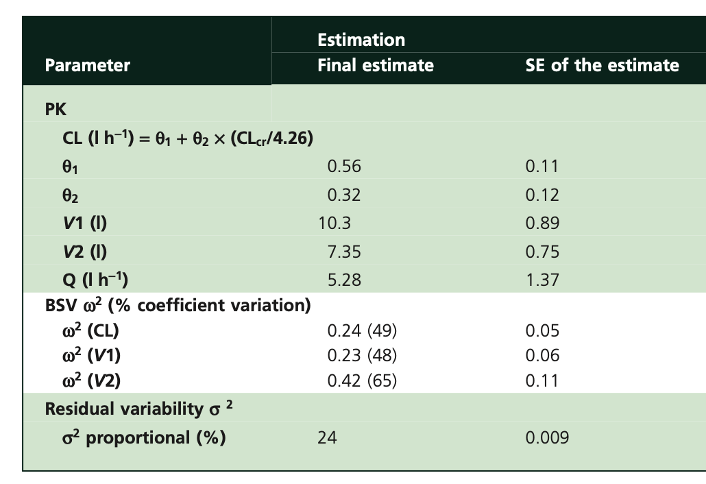
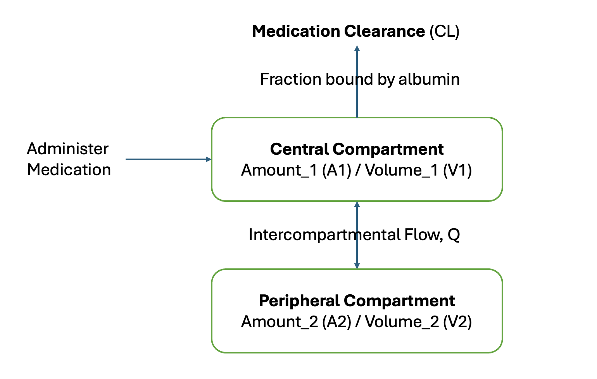
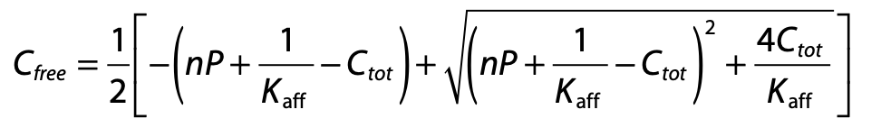

>🧪 Diving into PK/PD for the first time — simulating ceftriaxone with mrgsolve in R. Free drug levels were... surprisingly high? Even pushed it to q48h dosing out of curiosity and the results left me with more questions than answers 🤔📈


## Motivations
Learning pharmacokinetics (PK) and pharmocodynamics (PD) have always been an interest of mine. It's always challenging to read through these population PK papers with all the numbers etc. What's a better way of diving into the surface of these and see if we can at least know how to code a simulation to obtain the probability target attainment (PTA) of different minimal inhibitory concentration (mic) and learn the basics via code! Let's dive on!

#### Disclaimer:
*I am not a pharmacist and not an expert in PK/PD. This is a documentation for my own learning and for educational purposes only. Not a medical advice. If you noticed anything wrong here, please let me know!*

## Objectives:
- [What Is Population PK](#poppk)
- [What Are The Parameters of Interest On a Paper?](#param)
- [Let's Code](#code)
  - [Different CrCl](#crcl)
  - [Low Albumin](#albumin)
  - [?q48 Dosing](#48)
- [Oppotunities For Improvement](#opportunities)
- [Lessons Learnt](#lessons)

## What Is Population PK {#poppk}
Population pharmacokinetics (popPK) is a statistical approach that describes how medications behave in the body across groups of people, accounting for variability between individuals. Instead of studying one person intensively, popPK analyzes sparse data from many patients to understand typical medication behavior and why people differ in their medication exposure.

We'll use [Garot D et al Population pharmacokinetics of ceftriaxone in critically ill septic patients: a reappraisal](https://pmc.ncbi.nlm.nih.gov/articles/PMC3243010/pdf/bcp0072-0758.pdf) as an example for learning. 

## What Are The Parameters of Interest On a Paper? {#param}
From the paper, we can see that there are a lot of parameters and numbers. But what are the parameters of interest? We will focus on the following parameters:



Looking at their `table 3`, we see these values:     
`CL` = `\(\theta_1 + \theta_2 . (CL_{cr}/4.26)\)`       
`$\theta_1$` : Non-renal (baseline) clearance component     
`$\theta_2$` : Renal clearance scaling coefficient      
`V1` : Volume of distribution of the central compartment.      
`V2` : Volume of distribution of the peripheral compartment.       
`Q` : Inter-compartmental clearance.      
`$\omega^2 (CL)$` : Between-subject variability of clearance.      
`$\omega^2 (V1)$` : Between-subject variability of volume of distribution of the central compartment.      
`$\omega^2 (V2)$` : Between-subject variability of volume of distribution of the peripheral compartment.      
 
 These are the parameters we'll use in our mrgsolve model. I've always wondered what these parameters represent and it was a bit difficult to conceptualize until we dove into the code and finally understood the rationale! It's a mixed effect model where the estimates were modeled as a function of the fixed effect (theta) and the random effect (eta), you will see this in the code later. The fixed effect represents the typical value of the parameter in the population, while the random effect represents the variability between individuals. The random effect is assumed to be normally distributed with a mean of zero and a variance of omega squared.

If we were to draw a flow chart of the above, it will look something like this:

<p align="center">
  
</p>

One starts with medication being administered into the central compartment, and then it goes into either peripheral compartment (tissue etc) and medication clearance. Notice that the `Q` is a bidirectional flow between central and peripheral, whereas all other directions are either into central or out from central to clearance. This is very helpful for me to get a surface understanding of the distribution. Let's get on with the code!

## Let's Code {#code}


``` r
library(mrgsolve)
library(tidyverse)

mod <- mcode(model = "ceftriaxone", code='
$PARAM
theta1 = 0.56,
theta2 = 0.32,
CLcr   = 4.26,   // median creatinine clearance of 68.5 ml min-1, hence ~4.26 L hr-1
V1     = 10.3,
V2     = 7.35,
Q      = 5.28,  
fu     = 0.10  // fraction of unbound, picked a static value from package insert range

$CMT CENT PERI

$MAIN
double CL  = theta1 + theta2 * (CLcr / 4.26);  // technically we could use 0.88 as reported on their result section
double CLi = CL * exp(ETA(1));                  // ETA here means log normal distibution of mean 
double V1i = V1 * exp(ETA(2));     
double V2i = V2 * exp(ETA(3));

$OMEGA
0.24   // omega2(CL) from table
0.23
0.42

$SIGMA
0.0576   // √0.0576 = 0.24, 

$ODE
dxdt_CENT = -(CLi/V1i)*CENT - (Q/V1i)*CENT + (Q/V2i)*PERI;
dxdt_PERI =  (Q/V1i)*CENT   - (Q/V2i)*PERI;

$TABLE
double Cp_total = (CENT / V1i)*(1+EPS(1)); 
double Cp_free = fu * Cp_total;

$CAPTURE Cp_free
')

dosing <- ev(amt = 2000, rate = 4000, ii = 24, addl = 2, cmt = "CENT")

set.seed(1)
sims <- mod |>
  ev(dosing) |>
  mrgsim(nid = 1000, end = 72, delta = 0.25) |>
  as_tibble()
```

ETA in the above means the random effect, which is assumed to be normally distributed with a mean of zero and a variance of omega squared. ETA is a greek letter (eh-ta). EPS here is Epsilon. 

For `ev`, amount is dosing in `mg`; `rate` is amount given per hour; `ii` is frequency; `addl` is number of additional doses; `cmt` is the compartment where the dose is given. In this case, we are giving 2000 mg of ceftriaxone as a 30 minute infusion every 24 hours for 3 doses (1 initial dose + 2 additional doses) into the central compartment.

We will then need to set seed for reproducibility, pipe in your initial model with dosing, then `nid` is number of individuals you want to simulate, `end` is the end time of the simulation in hours, and `delta` is the time interval for the simulation output in hours. In this case, we are simulating 1000 individuals for 72 hours with a time interval of 0.25 hours (15 minutes).

Next, we'll calculate the probability of target attainment (PTA) for different minimal inhibitory concentration (MIC) values. The PTA is the probability that the free drug concentration exceeds the MIC for a certain percentage of the dosing interval.


``` r
MIC <- 1

print(paste0("Probability of Target Attainment: ", sims |>
  filter(time >= 48) |>
  group_by(ID) |>
  summarise(fT = mean(Cp_free > MIC)) |>
  summarise(PTA = mean(fT >= 0.50)) |>
  pull()))
```

```
## [1] "Probability of Target Attainment: 0.996"
```

``` r
sims |>
  ggplot(aes(x=time,y=Cp_free,group=ID)) +
  geom_line(alpha=0.01) +
  geom_hline(yintercept = MIC, color = "red") +
  theme_bw()
```

}}index_files/figure-html/unnamed-chunk-2-1.png" width="672" />

In the above we choose mic of 1, filtered off time after 48 hours for steady state, then calculate the average free ceftriaxone that is above the mic, then assess the mean of times where free ceftriaxone is above 50% per simulated subject. We can see that the probability of target attainment is around 99.6%. We can also visualize the free ceftriaxone concentration over time with a red line indicating the mic of 1. Not too shabby! Now let's assess when there is a difference in CrCl and albumin. I'll spare you the code.

### Changes in CrCl {#crcl}
<details>
<summary>code</summary>

``` r
library(glue)

crcl_vec <- c(1.8,7.2,10.8)
crcl_vec_i <- c(30, 120, 180)

# 30 ml/min = 1.8 L/hr
# 120 ml/min = 7.2 L/hr
# 180 ml/min = 10.8 L/hr

for (crcl in crcl_vec) {

mod <- mcode(model = "ceftriaxone", code=glue('
$PARAM
theta1 = 0.56,
theta2 = 0.32,
CLcr   = {crcl},
V1     = 10.3,
V2     = 7.35,
Q      = 5.28,  
fu     = 0.10  // fraction of unbound, picked a static value from package insert range

$CMT CENT PERI

$MAIN
double CL  = theta1 + theta2 * (CLcr / 4.26);  // technically we could use 0.88 as reported on their result section
double CLi = CL * exp(ETA(1));                  // ETA here means log normal distibution of mean 
double V1i = V1 * exp(ETA(2));     
double V2i = V2 * exp(ETA(3));

$OMEGA
0.24   // omega2(CL) from table
0.23
0.42

$SIGMA
0.0576   // √0.0576 = 0.24, 

$ODE
dxdt_CENT = -(CLi/V1i)*CENT - (Q/V1i)*CENT + (Q/V2i)*PERI;
dxdt_PERI =  (Q/V1i)*CENT   - (Q/V2i)*PERI;

$TABLE
double Cp_total = (CENT / V1i)*(1+EPS(1)); 
double Cp_free = fu * Cp_total;

$CAPTURE Cp_free
',crcl))

dosing <- ev(amt = 2000, rate = 4000, ii = 24, addl = 2, cmt = "CENT")

set.seed(1)
sims <- mod |>
  ev(dosing) |>
  mrgsim(nid = 1000, end = 72, delta = 0.25) |>
  as_tibble()

MIC <- 1

pta <- paste0("Probability of Target Attainment: ", sims |>
  filter(time >= 48) |>
  group_by(ID) |>
  summarise(fT = mean(Cp_free > MIC)) |>
  summarise(PTA = mean(fT >= 0.50)) |>
  pull(), " ,CrCl: ", crcl_vec_i[crcl_vec==crcl], "ml/min")


plot <- sims |>
  ggplot(aes(x=time,y=Cp_free,group=ID)) +
  geom_line(alpha=0.01) +
  geom_hline(yintercept = MIC, color = "red") +
  theme_bw() +
  ggtitle(pta)

plot(plot)
}
```
</details>

}}index_files/figure-html/unnamed-chunk-4-1.png" width="672" />}}index_files/figure-html/unnamed-chunk-4-2.png" width="672" />}}index_files/figure-html/unnamed-chunk-4-3.png" width="672" />

That's interesting! That makes sense, increased CrCl will increase clearance of ceftriaxone, hence decrease in PTA. It's still pretty good though! Though, what is considered acceptable? 90%? 70%? 50%? Also, the above PTA is based on 50% of a time free ceftriaxone is above MIC. What is the acceptable number for that then? 🤷‍♂️ What if, since ceftriaxone is albumin bound, if we model albumin into the model as well? 

### Changes With Hypoalbuminemia {#albumin}
Notice that our initial model had a fixed fraction of unbound (fu) of 0.1, which is the middle of the range reported in the package insert. However, in critically ill patients, hypoalbuminemia is common and can lead to an increase in the fraction of unbound drug, which can affect the pharmacokinetics and pharmacodynamics of ceftriaxone. Let's see how we can model this in our mrgsolve code. From the paper in method section, they used the formula below to estimate free ceftriaxone from total ceftriaxone:

<p align="center">
  
</p>

We'll add that to our model and adjust the `np` (total concentration of protein binding sites) according to estimate with lower albumin (np = 295), this number again was from the paper in the discussion portion where their median albumin were ~25g/L.


<details>
<summary>code</summary>

``` r
mod <- mcode(model = "ceftriaxone", code='
$PARAM
theta1 = 0.56,
theta2 = 0.32,
CLcr   = 4.26,
V1     = 10.3,
V2     = 7.35,
Q      = 5.28,
np     = 517,  
kaff   = 0.0367 

$OMEGA
0.24
0.23
0.42

$SIGMA
0.0576

$CMT CENT PERI

$GLOBAL
double solveFree(double CTOT, double np, double kaff) {
  double cf   = (-(np+1/kaff-CTOT)+sqrt(pow(np+1/kaff-CTOT,2.0)+(4.0*CTOT/kaff)));
  return cf > 0 ? cf : 0;
}

$MAIN
double CL  = theta1 + theta2 * (CLcr / 4.26);
double CLi = CL * exp(ETA(1));
double V1i = V1 * exp(ETA(2));
double V2i = V2 * exp(ETA(3));

$ODE
double CTOT  = CENT / V1i;           // renamed: avoid clash with $TABLE
double CFREE = solveFree(CTOT, np, kaff);

dxdt_CENT = -CLi * CFREE
            - (Q / V1i) * CENT
            + (Q / V2i) * PERI;

dxdt_PERI =  (Q / V1i) * CENT
            - (Q / V2i) * PERI;

$TABLE
double CTOTAL      = CENT / V1i;      // notice this is not CTOT
double Cp_free     = solveFree(CTOTAL, np, kaff);
double Cp_bound    = CTOTAL - Cp_free;
double FU          = Cp_free / (CTOTAL + 1e-9);
double Cp_obs      = CTOTAL * (1 + EPS(1));

$CAPTURE CTOTAL Cp_free Cp_bound FU Cp_obs
')

dosing <- ev(amt = 2000, rate = 4000, ii = 24, addl = 2, cmt = "CENT")

set.seed(1)
sims <- mod |>
  param(np = 295) |>
  ev(dosing) |>
  mrgsim(nid = 1000, end = 72, delta = 0.25) |>
  as_tibble()

MIC <- 1

pta <- paste0("Probability of Target Attainment: ", sims |>
  filter(time >= 48) |>
  group_by(ID) |>
  summarise(fT = mean(Cp_free > MIC)) |>
  summarise(PTA = mean(fT >= 0.50)) |>
  pull(),", Albumin: ~25g/L, CrCl: ~63 ml/min")

plot <- sims |>
  ggplot(aes(x=time,y=Cp_free,group=ID)) +
  geom_line(alpha=0.01) +
  geom_hline(yintercept = MIC, color = "red") +
  # geom_text(aes(x=20,y=150,label=pta)) +
  theme_bw() +
  ggtitle(pta)

plot(plot)
```
</details>


}}index_files/figure-html/unnamed-chunk-6-1.png" width="672" />

Wow, that's interesting! After we correctly fit in the free ceftriaxone estimation, it actually improved the PTA even when albumin is lower. What if we make albumin even lower to ~15g/L (np=~172), and increase our CrCl to 180 ml/min, and increase our fT >= 0.7 (more than 70% of the time free ceftriaxone is above mic), and see if we'll be able to clear the medication faster?

}}index_files/figure-html/unnamed-chunk-7-1.png" width="672" />

PTA is still 100% !?!?! wow, ceftriaxone 2g really is a beast! Hmmm.. The free ceftriaxone is REALLY high, around ~200-300, can we simulate a q48h dosing and see what the PTA is like, even for our worse case scenario, low albumin, high CrCl, and stil cover ft>mic >= 70%? 

### ?q48 Dosing {#48}
<details>
<summary>code</summary>

``` r
dosing <- ev(amt = 2000, rate = 4000, ii = 48, addl = 2, cmt = "CENT")

set.seed(1)
sims <- mod |>
  param(np = 172, CLcr = 10.8) |>
  ev(dosing) |>
  mrgsim(nid = 1000, end = 144, delta = 0.25) |>
  as_tibble()

MIC <- 1

pta <- paste0("PTA: ", sims |>
  filter(time >= 48) |>
  group_by(ID) |>
  summarise(fT = mean(Cp_free > MIC)) |>
  summarise(PTA = mean(fT >= 0.70)) |>
  pull(),", Albumin: ~15g/L, CrCl: ~180 ml/min, fT > mic >= 70%, q48h dosing")

plot <- sims |>
  ggplot(aes(x=time,y=Cp_free,group=ID)) +
  geom_line(alpha=0.01) +
  geom_hline(yintercept = MIC, color = "red") +
  theme_bw() +
  ggtitle(pta)

plot(plot)
```
</details>


}}index_files/figure-html/unnamed-chunk-9-1.png" width="672" />

Seriously!? PTA is still so high !? What does this actually mean? Is there literature on this? Maybe my code is not right... 🤔🤷‍♂️

Let's look at fT > mic >= 99%. 


```
## [1] "PTA: 0.979, Albumin: ~15g/L, CrCl: ~180 ml/min, fT > mic >= 99%, q48h dosing"
```

If you know anything about this, please let me know! this is for organism with mic <= 1, ceftriaxone 2g. Again, make note that this is purely for educational and learning purposes. The finding we got above is just a curious exploration. I wonder if there is some coding error on my part. Click the `code` above to expand for details. I also wonder if most of the trials we had before were based on higher mic, whereas the mic nowadays for ceftriaxone are mainly <= 1. 🤔


## Opportunities For Improvement {#opportunities}
- Learn how they model popPK, this will really help us understand how they got those theta and omega estimates
- I don't quite understand the sigma portion yet, will dive into this the next time, especially when estimating these values
- Try to learn other properties such as AUC/mic, Cmax/mic etc, and see how the PTA changes
- Learn more from literature which is preferred regarding acceptable free medication level above mic and acceptable PTA

## Lessons learnt {#lessons}
- learnt some mrgsolve model coding (uses cpp)
- learnt some basic pk/pd equations, popPK
- learnt about the 2 compartments
- found unexpected result for q48 dosing through simulation, still not sure if this is something real/true
- learnt that thetas are not related to central/peripheral, rather theta1 is baseline clearance and theta2 is ?renal scaling


If you like this article:
- please feel free to send me a [comment or visit my other blogs](https://www.kenkoonwong.com/blog/)
- please feel free to follow me on [BlueSky](https://bsky.app/profile/kenkoonwong.bsky.social), [twitter](https://twitter.com/kenkoonwong/), [GitHub](https://github.com/kenkoonwong/) or [Mastodon](https://rstats.me/@kenkoonwong)
- if you would like collaborate please feel free to [contact me](https://www.kenkoonwong.com/contact/)
