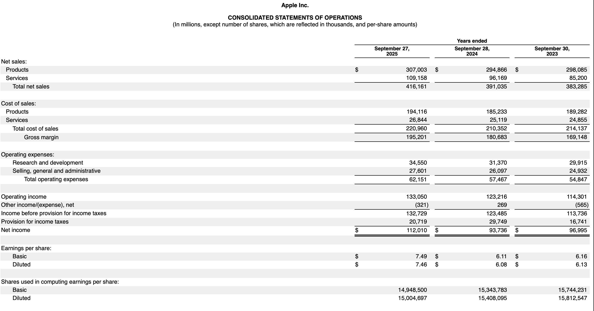
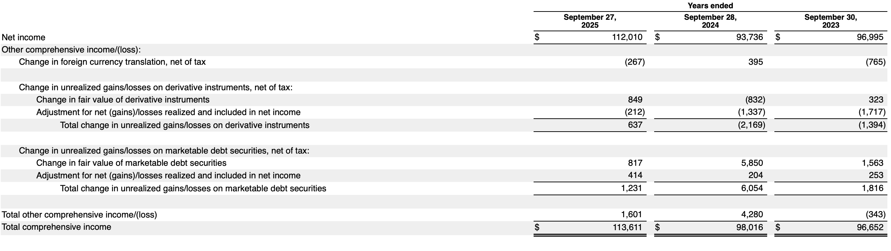
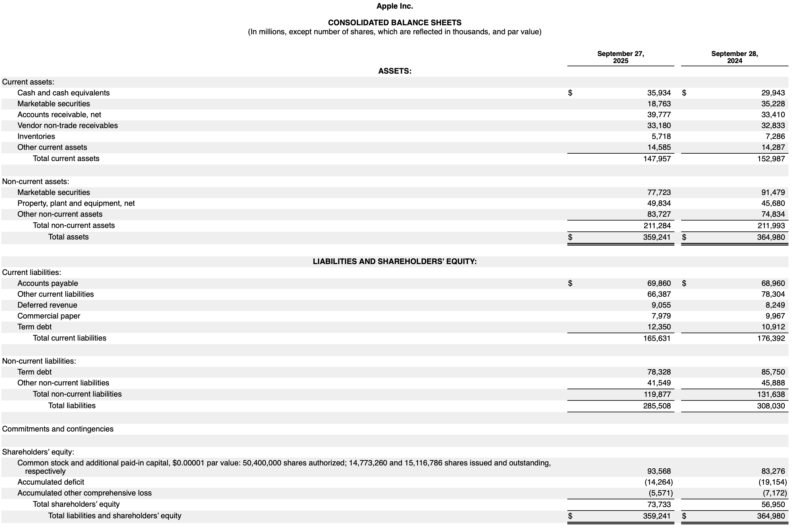
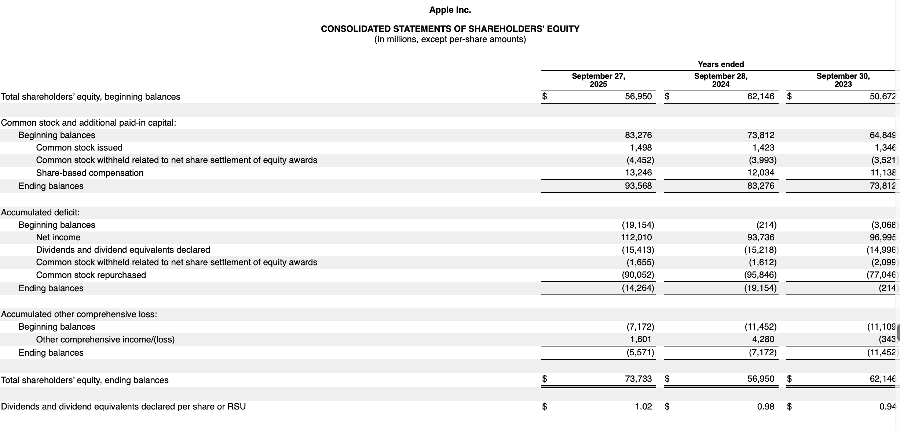
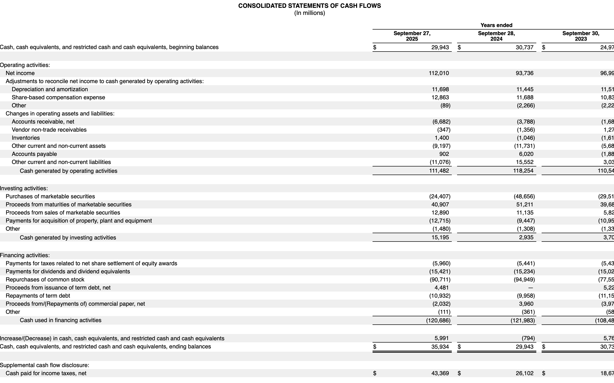

> 📊 Dipping my toes into financial statements — income, balance sheet & cash flow. Still don't fully get it, but slowly piecing together the story these numbers tell. Warren Buffett makes it look easy 😅 Baby steps! 🌱

## Motivations
I've always wanted to learn financial statement, what it means, what it tells us, what Warren Buffett sees in them. Following the book [Warren Buffett and the Interpretation of Financial Statements: The Search for the Company with a Durable Competitive Advantage](https://www.amazon.com/Warren-Buffett-Interpretation-Financial-Statements/dp/1849833192) and [Datacamp: Analyzing Financial Statement in Python](https://app.datacamp.com/learn/courses/analyzing-financial-statements-in-python), I've made some notes for myself and also create the metrics functions, so that I can use and view them easily in the future. I'll be honest, I still don't fully understand it, but at least I can refer back to this as I look at these statements more frequently.


#### Disclaimer:
*This is purely for educational purposes. This is not a financial advice, nor am I a financial advisor. This is a note to myself. If you find any mistakes or error, please let me know. Thanks! Also, there are a lot of information on each section, I won't be covering all of them, just mostly the metrics from the book and also points I found interesting.*


## Objectives:
- [The Skeleton of Financial Statements](#skeleton)
- [Let's Take An Example](#example)
- [Income Statement](#income)
  - [Gross Profit Margin](#gpm)
  - [Depreciation](#depreciation)
  - [Interest Payment to Operating Income](#interest)
  - [Income Before Tax](#incomebeforetax)
  - [Income After Tax](#incomeaftertax)
  - [Net Earnings](#netearnings)
  - [Per Share Earning](#share)
  - [Operating Margin](#operatingmargin)
  - [Metrics](#metric1)
- [Balance Sheet](#balance)
  - [Current Assets](#asset)
  - [Net Receivables To Gross Sale Ratio](#receivables)
  - [The Current Ratio](#currentratio)
  - [Property, Plant, and Equipment](#ppe)
  - [Short Term Debt](#short)
  - [Long Term Debt](#long)
  - [Retained Earnings](#retained)
  - [Treasury Stock](#treasury)
  - [Return On Shareholders' Equity](#ROSE)
  - [Metrics](#metric2)
- [Cash Flow](#cashflow)
  - [Operating Income](#operating)
  - [Capital Expenditure](#capex)
  - [Stock Buyback](#buyback)
  - [Metrics](#metric3)
- [Combine All Metrics](#combine)
- [Let's Look At Another Examples](#another)
- [Oppotunities For Improvement](#opportunities)
- [Lessons Learnt](#lessons)

## The Skeleton of Financial Statements {#skeleton}
A financial statement is a formal record that shows a company's financial activities and position, typically consisting of three core components: the `income statement` (which shows revenues earned and expenses incurred to calculate profit or loss over a period), the `balance sheet` (which presents what the company owns as assets, what it owes as liabilities, and the difference between them as equity at a specific point in time), and the `cash flow` statement (which tracks the actual movement of cash in and out of the business through operating activities, investing activities, and financing activities). The `income statement reveals profitability`, and the `cash flow statement shows liquidity` and how money actually moves through the business. 

If we were to think of a kid's lemonaid shop, the `income statement` would show how much money the shop made from selling lemon tea and how much it spent on ingredients, paying Johnny hourly to sell (salary) to calculate the profit. The `balance sheet` would list the shop's assets (like cash in the register, inventory of lemons, sugar, and any equipment) and liabilities (like loans or unpaid bills - money your parent you borrowed from to buy all of the above) to show the net worth of the business at a given moment. The `cash flow statement` would track the actual cash coming in from customers and going out for expenses, giving insight into whether the shop has enough liquidity to cover its day-to-day operations. 

It sounds simple, in the big picture, but these are just the basic skeleton of financial statements. There are many nuances and details that we need to understand to really grasp the story that these statements are telling us.Each section has its own items and some of these items are good at forming different metrics to tell the story of how the lemonaid business is doing. Below is just a snapshot of Apple's financial statement.

#### Income Statement
<p align="center">
  
</p>
<p align="center">
  
</p>

#### Balance Sheet
<p align="center">
  
</p>
<p align="center">
  
</p>

#### Cash Flow
<p align="center">
  
</p>

## Let's Take An Example {#example}
Let's go to [Alpha Vantage](https://www.alphavantage.co/) and create a free api key and then pull Apple's 10 year financial statement and go through as an exercise.

https://www.sec.gov/Archives/edgar/data/320193/000032019325000079/aapl-20250927.htm#i719388195b384d85a4e238ad88eba90a_181


``` r
library(httr)
library(jsonlite)
library(tidyverse)

api_key <- "your_api_key_here" # Use .Renviron to be safer like below combine_all code

## Create a function to pull data
get_data <- function(fx,ticker) {
  raw <- GET(paste0(
    "https://www.alphavantage.co/query?function=",fx,
    "&symbol=",ticker,"&apikey=", api_key
  )) %>%
    content(as = "text", encoding = "UTF-8") %>%
    fromJSON()
  
  df <- raw$annualReports |> 
    as_tibble() |> 
    mutate(across(-c(fiscalDateEnding, reportedCurrency), as.numeric)) |>
    mutate(fiscalDateEnding = as.Date(fiscalDateEnding)) |>
    arrange(fiscalDateEnding)

  return(df)
}

## financial statement
income <- get_data("INCOME_STATEMENT","AAPL")
balance <- get_data("BALANCE_SHEET","AAPL")
cashflow <- get_data("CASH_FLOW","AAPL")
```

Let's visualize the income statement

}}index_files/figure-html/unnamed-chunk-2-1.png" width="960" />


## Income Statement {#income}
Alright, here we go! Income statement tells the story of how the goods and services are doing in the market, how much it costs to produce and sell them, and how much profit is left after all expenses are accounted for. It is a dynamic statement that shows the flow of money over a period of time, typically a quarter or a year. It is like a movie that tells the story of the company's operations and profitability. Below are some ratios and heuristics of which companies have a durable competitive advantage, according to Warren Buffett.

### Gross Profit Margin {#gpm}

`\(Gross Profit Margin = Gross Profit / Total Revenue\)`

In the book, we are looking for consistent, as a general rule, `above 40%` to consider a company to have a durable competitive advantage. Gross profit here is basically `Total Revenue - Cost of Revenue`, does not take into account of R&D, admin etc. Gross profit margin is a measure of how much profit a company makes from its core operations, before accounting for other expenses. A higher gross profit margin indicates that the company has a strong competitive position in the market and is able to generate more profit from its sales. 

So on Apple, you can see that in the sales section, there is product and service. I assume product is the hardware and service is like the cloud storage etc. The cost of revenue section has the same sections, that depicts how much cost to make these products/services. Again, remember this is all just about the goods, does not take into account of the R&D, office that manages these, administrative etc, I think. 🤔

### Depreciation {#depreciation}
Apparently this is a non-cash expense that reflects the reduction in value of a company's assets over time. It is an accounting method used to allocate the cost of tangible assets (like machinery, equipment, buildings) and intangible assets (like patents, copyrights) over their useful lives. Depreciation allows companies to spread out the expense of an asset over several years, rather than recognizing the entire cost in the year it was purchased. 

A quick ratio in the book is 

`\(Depreciation / Gross Profit\)` 

which should be low `~5-7%` which indicates that the company is not heavily reliant on physical assets that may lose value over time. Warren stated that EBITDA (Earnings Before Depreciation, Taxes, and Amortization) is something Wall Street loves, but in Warren's eyes, depreciation is a real expanse. Why is it that he said EBITDA is something Wall Street love? Because it shows a higher profit by excluding non-cash expenses like depreciation, which can make a company look more profitable than it actually is... interesting. 🤔

### Interest Payment to Operating Income {#interest}
`\(Interest Payment / Operating Income\)`

should be `less than 15%`. This ratio indicates that the company is not overly burdened by debt and has a healthy balance between its operating income and interest expenses. A lower ratio suggests that the company is generating sufficient operating income to cover its interest payments, which is a positive sign of financial stability.

`Operating Income = Total Revenue - Cost of Revenue - Operating Expenses`. And `Operating Expenses = R&D + Selling, General and Administrative Expenses`. Wow, so many terminologies and I still don't fully understand them, but at least I can refer back to this when I look at these statements.   

### Income Before Tax {#incomebeforetax}
This is a value that Warren uses when he calculates the return that he is getting when he a whole business. 

### Income After Tax {#incomeaftertax}
This is a value is the truth test of a business. What is reported with SEC should reflect the pre-tax income reported on the income statement. Apparently some companies like to report higher values than the the truth? was what the book said 🤔

### Net Earnings {#netearnings}
`\(Net Earning / Total Revenue\)`

The heuristic for this is we should look for `more than 20%` which indicates that the company is able to generate a significant amount of profit from its total revenue, hence a long term competitive advantage.

`Net Earnings = Operating Income - Interest Expense - Taxes`. This is the bottom line of the income statement, which represents the company's total profit after all expenses have been deducted from total revenue. It is a key indicator of a company's profitability and financial performance. A higher net earnings figure indicates that the company is generating more profit from its operations, which can be a sign of a strong competitive position in the market.Interest Expense - Taxes`. 

### Per Share Earning {#share}
This is something Warren wants to see consistent increment over time. 

This is calculated by:
`\(EPS = Net Income/Outstanding Share\)`

Does that mean if net income is negative, we'll have negative share? 🤔

### Operating Margin {#operatingmargin}
`\(Operating Margin = Operating Income / Total Revenue\)`

This is a measure of a company's profitability that indicates how much profit it generates from its operations relative to its total revenue. A higher operating margin suggests that the company is more efficient at converting revenue into profit, which can be a sign of a strong competitive position in the market. Though I'm unsure what is a good heuristic for this, we'll use `more than 10%`. What do you think?

#### Metrics {#metric1}

``` r
income_metric <- function(df) {
  df_i <- df |>
    mutate(grossProfitMargin = grossProfit / totalRevenue,
           depreciationToGrossProfit = depreciationAndAmortization / grossProfit,
           interestExpenseToOperatingIncome = interestExpense / operatingIncome,
           netEarningMargin = netIncome / totalRevenue,
           operatingMargin = operatingIncome / totalRevenue)
  
  hline <- tribble(
    ~param, ~hline_value, ~color2,
    "grossProfitMargin", 0.4, "red", 
    "depreciationToGrossProfit", 0.07, "blue",
    "interestExpenseToOperatingIncome", 0.15, "blue",
    "netEarningMargin", 0.2, "red",
    "operatingMargin", 0.1, "red"
  ) |>
    mutate(
      param = factor(param),
      ymin = ifelse(color2 == "red", -Inf, hline_value),
      ymax = ifelse(color2 == "red", hline_value, Inf)
    )
  
  columns <- hline$param
  
  plot <- df_i |>
    select(fiscalDateEnding, grossProfitMargin:operatingMargin) |>
    pivot_longer(cols = c(grossProfitMargin:operatingMargin), 
                 names_to = "param", values_to = "values") |>
    mutate(param = factor(param, levels = columns)) |> 
    ggplot(aes(x = fiscalDateEnding, y = values)) +
    geom_rect(
      data = hline,
      aes(ymin = ymin, ymax = ymax, fill = color2),
      xmin = -Inf, xmax = Inf,
      alpha = 0.15,
      inherit.aes = FALSE
    ) +
    geom_line() +
    facet_wrap(. ~ param, scale = "free_y") +
    scale_fill_identity() +
    theme_bw()
  
  return(plot)
}

income_metric(income) 
```

}}index_files/figure-html/unnamed-chunk-3-1.png" width="672" />


## Balance Sheet {#balance}

`\(Asset = Liability + Shareholder Equity\)`

 Reminded me of Full Metal Alchemist famous phrase "tōka kōkan", equivalent exchange.

<p align="center">

</p>


### Current Assets {#asset}
Current asset is any asset that can be reasonably expected to be converted into cash within one year. This includes cash and cash equivalents, accounts receivable, inventory, and other short-term assets. Current assets are important because they provide insight into a company's liquidity and ability to meet its short-term obligations.

### Net Receivables To Gross Sale Ratio {#receivables}
`\(Net Receivables / Gross Sale\)`

If a company consistently has a lower ratio (? `5%` or less), it may indicate that the company is efficient in collecting payments from customers and has a lower risk of bad debts. A higher ratio may suggest that the company is having difficulty collecting payments, which could lead to cash flow issues and potential losses from uncollected receivables.

### The Current Ratio {#currentratio}
`\(Current Ratio = Total Current Assets / Total Current Liabilities\)`

The current ratio is a liquidity ratio that measures a company's ability to pay off its short-term liabilities with its short-term assets. A current ratio of `1 or higher` is generally considered good, indicating that the company has enough assets to cover its liabilities. A current ratio below `1` may indicate that the company may have difficulty meeting its short-term obligations. This makes sense.

### Property, Plant, and Equipment {#ppe}
This is the value of a company's physical assets, such as land, buildings, machinery, and equipment. It is important to consider the value of PPE when evaluating a company's financial health and potential for growth. A company with a significant amount of PPE may have a competitive advantage in its industry, as it may be able to produce goods or services more efficiently than its competitors. However, it is also important to consider the age and condition of the PPE, as well as any potential liabilities associated with it. In the title of this chapter, it says `For Warren Not Having Them Is A Good Thing` 🤣

### Short Term Debt {#short}
From Warren's perspective, when it comes to investing in financial institutions, he's always shied away from companies who are bigger borrowers in short-term than long-term. 

`\(Short Term Debt/ Long Term Debt\)`

Not really sure what the heuristic threshold is, but let's use `less than 1` as a good indicator?

### Long Term Debt {#long}
As a general rule, a company with durable competitve edge, will have no or little long term debt to maintain their business operation. Let's ensure this is not an uptrend on visualization

### Retained Earnings {#retained}
Retained earnings is the portion of a company's net income that is retained and not distributed as dividends to shareholders. It represents the accumulated profits that a company has reinvested in its business over time. Retained earnings can be used for various purposes, such as funding research and development, expanding operations, paying off debt, or acquiring other companies. It is an important metric for investors to consider when evaluating a company's financial health and growth potential, as it indicates how much profit the company has generated and how it has been utilized to support its long-term success.

`\(Growth Rate = (Ending Retained Earnings/Beginning Retained Earnings)^{1/years}-1\)`

### Treasury Stock {#treasury}
Treasury stock refers to shares that a company has repurchased from its shareholders. These shares are held in the company's treasury and are not considered outstanding shares. Treasury stock can be used for various purposes, such as to increase shareholder value, to have shares available for employee compensation plans, or to prevent hostile takeovers. When a company repurchases its own shares, it reduces the number of outstanding shares in the market, which can increase the value of the remaining shares and potentially boost earnings per share (EPS). However, it is important for investors to consider the reasons behind a company's decision to buy back its own stock and how it may impact the company's financial health and long-term growth prospects.

### Return On Shareholders' Equity {#ROSE}
`\(Return On Shareholders' Equity = Net Income / Shareholders' Equity\)`

According to the book, `high ROSE means come play` 🤣 How about stop and smell the rose? 🌹 The book did not tell us exactly what the threshold is, but the companies of choice has about `~30-35%`

#### Metrics

``` r
balance_metric <- function(df, income) {
  df_b <- df |>
    mutate(currentRatio = totalCurrentAssets / totalCurrentLiabilities,
           netReceivablesToGrossSale = currentNetReceivables / income$grossProfit,
           shortToLongTermDebt = shortTermDebt / longTermDebt,
           growthRateRetainedEarnings = (retainedEarnings / lag(retainedEarnings))^(1/n()) - 1,
           returnOnShareholdersEquity = income$netIncome / totalShareholderEquity)
  
  hline <- tribble(
    ~param, ~hline_value, ~color2,
    "currentRatio", 1, "red", 
    "netReceivablesToGrossSale", 0.05, "blue",
    "shortToLongTermDebt", 1, "blue",
    "growthRateRetainedEarnings", 0.05, "red",
    "returnOnShareholdersEquity", 0.3, "red"
  ) |>
    mutate(
      param = factor(param),
      ymin = ifelse(color2 == "red", -Inf, hline_value),
      ymax = ifelse(color2 == "red", hline_value, Inf)
    )
  
  columns <- hline$param
  
  plot <- df_b |>
    select(fiscalDateEnding, currentRatio:returnOnShareholdersEquity) |>
    pivot_longer(cols = c(currentRatio:returnOnShareholdersEquity), 
                 names_to = "param", values_to = "values") |>
    mutate(param = factor(param, levels = columns)) |> 
    ggplot(aes(x = fiscalDateEnding, y = values)) +
    geom_rect(
      data = hline,
      aes(ymin = ymin, ymax = ymax, fill = color2),
      xmin = -Inf, xmax = Inf,
      alpha = 0.15,
      inherit.aes = FALSE
    ) +
    geom_line() +
    facet_wrap(. ~ param, scale = "free_y") +
    scale_fill_identity() +
    theme_bw()
  
  return(plot)
}

balance_metric(balance, income)
```

}}index_files/figure-html/unnamed-chunk-4-1.png" width="672" />


## Cash Flow {#cashflow}

### Operating Income {#operating}
Cash flow from operating income starts with net income and then add back depreciation and amortization. This is because depreciation and amortization are non-cash expenses that reduce net income but do not actually involve a cash outflow. By adding them back, we can get a better picture of the actual cash generated by the company's operations. 

### Capital Expenditure {#capex}
Also known as CapEx, refers to the funds that a company uses to acquire, upgrade, and maintain physical assets such as property, buildings, technology, equipment, or machinery. CapEx is an important metric for investors to consider when evaluating a company's financial health and growth potential, as it indicates how much the company is investing in its long-term success. 

If we were to look at Apple's cash flow statement, CapEx is payments for acquisition of proptery, plant, and equipment. 

`\(Capital Expenditure/Net Earning\)` 

And the heuristic is `~50% or less`.

### Stock Buyback {#buyback}
Stock buyback, also known as share repurchase, refers to a company's practice of buying back its own shares from the open market. This can be done for various reasons, such as to increase shareholder value, to have shares available for employee compensation plans, or to prevent hostile takeovers. When a company repurchases its own shares, it reduces the number of outstanding shares in the market, which can increase the value of the remaining shares and potentially boost earnings per share (EPS). 

On the Apple cash flow statement, stock buyback is listed as repurchase of common stocks. Others might use issuance of (retirement) stocks. 

#### Metrics

``` r
cashflow_metric <- function(df) {
  df_c <- df |>
    mutate(operatingCashFlow = netIncome + depreciationDepletionAndAmortization,
           capitalExpenditureToNetEarning = capitalExpenditures / netIncome,
           stockBuybackToNetEarning = abs(proceedsFromRepurchaseOfEquity / netIncome))
  
  hline <- tribble(
    ~param, ~hline_value, ~color2,
    "operatingCashFlow", 0, "red", 
    "capitalExpenditureToNetEarning", 0.5, "blue",
    "stockBuybackToNetEarning", 0.5, "red"
  ) |>
    mutate(
      param = factor(param),
      ymin = ifelse(color2 == "red", -Inf, hline_value),
      ymax = ifelse(color2 == "red", hline_value, Inf)
    )
  
  columns <- hline$param
  
  plot <- df_c |>
    select(fiscalDateEnding, operatingCashFlow, capitalExpenditureToNetEarning, stockBuybackToNetEarning) |>
    pivot_longer(cols = c(operatingCashFlow, capitalExpenditureToNetEarning, stockBuybackToNetEarning), 
                 names_to = "param", values_to = "values") |>
    mutate(param = factor(param, levels = columns)) |> 
    ggplot(aes(x = fiscalDateEnding, y = values)) +
    geom_rect(
      data = hline,
      aes(ymin = ymin, ymax = ymax, fill = color2),
      xmin = -Inf, xmax = Inf,
      alpha = 0.15,
      inherit.aes = FALSE
    ) +
    geom_line() +
    facet_wrap(. ~ param, scale = "free_y") +
    scale_fill_identity() +
    theme_bw()
  
  return(plot)
}

cashflow_metric(cashflow)
```

}}index_files/figure-html/unnamed-chunk-5-1.png" width="672" />
  
  

  
  
Use key valuation metrics (P/E, EV/EBITDA, P/B, P/S, etc) to determine how cheap or expensive a stock is.


## Combine All Metrics {#combine}
<details>
<summary>code</summary>

``` r
library(httr)
library(jsonlite)
library(tidyverse)
library(ggpubr)

api_key <- Sys.getenv("avkey")

## Create a function to pull data
get_data <- function(fx,ticker,share=F) {
  raw <- GET(paste0(
    "https://www.alphavantage.co/query?function=",fx,
    "&symbol=",ticker,"&apikey=", api_key
  )) %>%
    content(as = "text", encoding = "UTF-8") %>%
    fromJSON()
  
  if (share==T) {
    df <- raw$annualEarnings |>
      select(fiscalDateEnding, reportedEPS) |>
      mutate(fiscalDateEnding = ymd(fiscalDateEnding))
  } else {
  df <- raw$annualReports |> 
    as_tibble() |>
    mutate(fiscalDateEnding = as.Date(fiscalDateEnding)) |>   
    mutate(across(where(is.character), as.numeric)) |>        
    arrange(fiscalDateEnding)
  }

  return(df)
}

income_metric <- function(df) {
  df_i <- df |>
    mutate(grossProfitMargin = grossProfit / totalRevenue,
           depreciationToGrossProfit = depreciationAndAmortization / grossProfit,
           interestExpenseToOperatingIncome = interestExpense / operatingIncome,
           netEarningMargin = netIncome / totalRevenue,
           operatingMargin = operatingIncome / totalRevenue)
  
  hline <- tribble(
    ~param, ~hline_value, ~color2,
    "grossProfitMargin", 0.4, "red", 
    "depreciationToGrossProfit", 0.07, "blue",
    "interestExpenseToOperatingIncome", 0.15, "blue",
    "netEarningMargin", 0.2, "red",
    "operatingMargin", 0.1, "red"
  ) |>
    mutate(
      param = factor(param),
      ymin = ifelse(color2 == "red", -Inf, hline_value),
      ymax = ifelse(color2 == "red", hline_value, Inf)
    )
  
  columns <- hline$param
  
  plot <- df_i |>
    select(fiscalDateEnding, grossProfitMargin:operatingMargin) |>
    pivot_longer(cols = c(grossProfitMargin:operatingMargin), 
                 names_to = "param", values_to = "values") |>
    mutate(param = factor(param, levels = columns)) |> 
    ggplot(aes(x = fiscalDateEnding, y = values)) +
    geom_rect(
      data = hline,
      aes(ymin = ymin, ymax = ymax, fill = color2),
      xmin = -Inf, xmax = Inf,
      alpha = 0.15,
      inherit.aes = FALSE
    ) +
    geom_line() +
    facet_wrap(. ~ param, scale = "free_y") +
    scale_fill_identity() +
    theme_bw() +
    ggtitle("Income Statement Metrics")
  
  return(plot)
}

share_metric <- function(df) {
    plot <- df |>
      mutate(reportedEPS = as.numeric(reportedEPS)) |>
      ggplot(aes(x = fiscalDateEnding, y = reportedEPS)) +
      geom_line() +
      geom_smooth() +
      theme_bw() +
      ggtitle("Share Metrics")
    return(plot)
}

balance_metric <- function(df, income) {
  df_b <- df |>
    mutate(currentRatio = totalCurrentAssets / totalCurrentLiabilities,
           netReceivablesToGrossSale = currentNetReceivables / income$grossProfit,
           shortToLongTermDebt = shortTermDebt / longTermDebt,
           growthRateRetainedEarnings = (retainedEarnings / lag(retainedEarnings))^(1/n()) - 1,
           returnOnShareholdersEquity = income$netIncome / totalShareholderEquity)
  
  hline <- tribble(
    ~param, ~hline_value, ~color2,
    "currentRatio", 1, "red", 
    "netReceivablesToGrossSale", 0.3, "blue",
    "shortToLongTermDebt", 1, "blue",
    "growthRateRetainedEarnings", 0.05, "red",
    "returnOnShareholdersEquity", 0.3, "red"
  ) |>
    mutate(
      param = factor(param),
      ymin = ifelse(color2 == "red", -Inf, hline_value),
      ymax = ifelse(color2 == "red", hline_value, Inf)
    )
  
  columns <- hline$param
  
  plot <- df_b |>
    select(fiscalDateEnding, currentRatio:returnOnShareholdersEquity) |>
    pivot_longer(cols = c(currentRatio:returnOnShareholdersEquity), 
                 names_to = "param", values_to = "values") |>
    mutate(param = factor(param, levels = columns)) |>
    ggplot(aes(x = fiscalDateEnding, y = values)) +
    geom_rect(
      data = hline,
      aes(ymin = ymin, ymax = ymax, fill = color2),
      xmin = -Inf, xmax = Inf,
      alpha = 0.15,
      inherit.aes = FALSE
    ) +
    geom_line() +
    facet_wrap(. ~ param, scale = "free_y") +
    scale_fill_identity() +
    theme_bw() +
    ggtitle("Balance Sheet Metrics")
  
  return(plot)
}

cashflow_metric <- function(df, income) {
  df_c <- df |>
    mutate(operatingCashFlow = netIncome + depreciationDepletionAndAmortization,
           capitalExpenditureToNetEarning = capitalExpenditures / netIncome,
           stockBuybackToNetEarning = case_when(
             proceedsFromRepurchaseOfEquity < 0 ~ -proceedsFromRepurchaseOfEquity / income$netIncome,
             income$netIncome < 0 & proceedsFromRepurchaseOfEquity > 0 ~ NA_real_,
             income$netIncome < 0 & proceedsFromRepurchaseOfEquity < 0 ~-proceedsFromRepurchaseOfEquity / income$netIncome))
  
  hline <- tribble(
    ~param, ~hline_value, ~color2,
    "operatingCashFlow", 0, "red", 
    "capitalExpenditureToNetEarning", 0.5, "blue",
    "stockBuybackToNetEarning", 0.5, "red"
  ) |>
    mutate(
      param = factor(param),
      ymin = ifelse(color2 == "red", -Inf, hline_value),
      ymax = ifelse(color2 == "red", hline_value, Inf)
    )
  
  columns <- hline$param
  
  plot <- df_c |>
    select(fiscalDateEnding, operatingCashFlow, capitalExpenditureToNetEarning, stockBuybackToNetEarning) |>
    pivot_longer(cols = c(operatingCashFlow, capitalExpenditureToNetEarning, stockBuybackToNetEarning), 
                 names_to = "param", values_to = "values") |>
    mutate(param = factor(param, levels = columns)) |> 
    ggplot(aes(x = fiscalDateEnding, y = values)) +
    geom_rect(
      data = hline,
      aes(ymin = ymin, ymax = ymax, fill = color2),
      xmin = -Inf, xmax = Inf,
      alpha = 0.15,
      inherit.aes = FALSE
    ) +
    geom_line() +
    facet_wrap(. ~ param, scale = "free_y") +
    scale_fill_identity() +
    theme_bw() +
    ggtitle("Cash Flow Metrics")
  
  return(plot)
}

show_all <- function(name) {
  income <- get_data("INCOME_STATEMENT",name)
  share <- get_data("EARNINGS",name,share=T)
  balance <- get_data("BALANCE_SHEET",name)
  cashflow <- get_data("CASH_FLOW",name)
  plot1 <- income_metric(income) 
  plot2 <- share_metric(share)
  plot3 <- balance_metric(balance, income)
  plot4 <- cashflow_metric(cashflow, income)
  stacked_plot <- ggarrange(plot1,plot3,nrow=2)
  squished_plot <- ggarrange(plot4,plot2,ncol=2, widths = c(2,1))
  combineplot <- ggarrange(plotlist = list(stacked_plot,squished_plot), nrow = 2, heights = c(2,1))
  return(combineplot)
}
```
</details>

## Let's Look At Another Example {#another}

As a heuristics, we've made our dataviz where `red is like lava`, you want to stay above it. `Blue is like the sky`, you want to stay below it. The sweet zone is in between. 🤣 When there is a loess curve, we are trying to see if the share is consistently increasing. 

#### Apple

``` r
show_all("AAPL")
```

}}index_files/figure-html/unnamed-chunk-7-1.png" width="864" />

Looking the income metrics, Apple seems to be doing pretty good. Gross profit margin, net earning margin, operating income margin are all above thresholds. Depreciation to gross profit ratio is appropriately below the threshold, which means there is no recent purchase of property, plants, machines, etc where these are the ones that will add to depreciation. There is also a low to no interest expense, which is good! No debt? Next we move on to balance sheet metrics, current ratio is not great, liquidity is not great, net receivable is ?OK, I guess it make sense, if your products are popular and provide some sort of finance option, you might have some receivables. Short term debt is much lower than long term debt, which is good. The ROSE is smelling pretty good there too! In terms of cash flow metrics, it's looking really good, it has high cash flowing in, low CapEx, and consistently buying its own share from 2020 onwards. 

#### Microsoft

``` r
show_all("MSFT")
```

}}index_files/figure-html/unnamed-chunk-8-1.png" width="864" />

As for Microsoft, now that we're a bit more familiar with the sections, let's just string our read instead of separating them. Good consistent profit for all profit, operating and net income. Interestingly, depreciation is high along with CapEx, did they buy property, plants or machine? [Ah, they built data center?](https://www.ciodive.com/news/microsoft-azure-capacity-constraints-datacenter-buildouts-cloud-ai/722912/) Interest expense is low, which is good. Good liquidity factor with current ratio above threshold, net receivables is OK same as Apple (a competitor), short/long debt is good as well. ROSE is close to the threshold (worth watching). Cash is flowing, not much stock buyback, but overall EPS is consistently increasing. With its investment in data centers for Azure, next few years we should be seeing a persistent depreciation to gross profit ratio, along with CapEx, right? I read somewhere where you can't place all depreciation in a single year. 

#### NVIDIA

``` r
show_all("NVDA")
```

}}index_files/figure-html/unnamed-chunk-9-1.png" width="864" />

Now let's take a look at NVIDIA. Wow, gross profit, operating income, and net earning margin all really good, better than Apple and Microsoft! Well, make sense with all these data centers, they need GPUs from NVIDIA. Look at that depreciation and CapEx, barely any! That's great, less to maintain and the current plants they have are adequate to supply the demand. Low interest expense too, not much debt interest. Liquidity is great with high current ratio! Net receivables is good too, these big companies are paying NVIDIA back! ROSE is also very fragrant! Cash is flowing through the roof. Not much stock buyback. Also exponential EPS! You know, Warren did say that be mindful of companies with R&D cost. 

#### Intel

``` r
show_all("INTC")
```

}}index_files/figure-html/unnamed-chunk-10-1.png" width="864" />

Wow, first glance with the profits, we're seeing lava red. We then see high rise in depreciation and CapEx. Did they buy more property, plants, or machines? [Intel announces plans for an investment of more than $28 billion for two new chip factories in Licking County, Ohio](https://newsroom.intel.com/press-kit/intel-invests-ohio). And maybe Germany and Arizona too? Interesting. Notice that the interest expense towards the end of 2025 was in 2 digit but negative? It's because the the operating income was negative and a high interest expense. I wonder if I should make this absolute as opposed to keeping the negative. Anyway, this means that not only was Intel in the red but also paying quite a bit of interest from the debt, I assume. The current ratio looks pretty good, same goes with the net receivables. Short term debt is also much lower compared to long term. ROSE not so good. As for the cash flow, when we add depreciation and demortization back to net income, it brought the red back up. Notice how the EPS dropped significantly lately, and notice that the buyback of share is missing? We code it where if it's a positive value of buyback, which means it's issuing stock instead of repurchasing, hence NA. Wow, what do you think? Will they be able to turn this around? Do data centers use Intel chips or AMD's threadripper?

#### AMD

``` r
show_all("AMD")
```

}}index_files/figure-html/unnamed-chunk-11-1.png" width="864" />

Interesting income statement metric results. Good gross profit margin, but the net earning is barely. Interesting depreciation trend, what happened in 2024, where CapEx didn't budge? Great liquidity, pretty high net receivables. Wow, very high short-to-long term debt in ?2021-2022. ROSE is essentially 0. With cash flowing good towards 2025, and also high buybacks 2022 ish. Finally, uptrending EPS! This is an odd one. Pasting my observation onto Claude and wow, these findings are due to Xilinx acquisition. That makes sense! Didn't build new plants, old property, plants, machines have already been amortized, hence low depreciation. The acquisition is funded by debt, hence high short-to-long term debt ratio. Very interesting, indeed! So, it could be true that data centers prefer AMD over Intel given the good profit?

#### Google

``` r
show_all("GOOG")
```

}}index_files/figure-html/unnamed-chunk-12-1.png" width="864" />

Very good profit of all 3 metrics. After 2020, depreciation downtrended which is good and so did CapEx. Not much debt. Downtrending current ratio but still good. Very good net receivables! ROSE is coming up. Great cash flow. There is buyback of equity. Rising EPS. All great signs for Google! Being an all-service (no hardware?) company, this is quite good and healthy!

#### 3M

``` r
show_all("MMM")
```

}}index_files/figure-html/unnamed-chunk-13-1.png" width="864" />

Now on to 3M, not a tech company, but let's see if our workflow of looking at financial statement will help us tell a story. Profit is not as great as other tech companies we looked at, though gross profit is above threshold, but the net earnings is in the lava. Notice both net earnings and operating margins dipped quite low in 2024? And then a pretty high interest expense to operating income ratio in 2025? I wonder if because of losing money, they borrowed long term, hence short-to-long term debt is not too high? Current ratio is acceptable, but why is net receivables so high for 3M? Clients were not able to pay 3M? ROSE is pretty good in 2024 and 2025 even when profits weren't. But why? Cash flow with high variance last 3 years. There is stock buyback in 2025. And even though EPS downtrended past 2 years but still remained high. This is a very interesting one as well. 3M should be a company where there's competitive advantage because they make lots of daily usables which doesn't need a whole lot of R&D. But why the anomaly in 2024 requiring debt? What do you think? 


#### Disney

``` r
show_all("DIS")
```

}}index_files/figure-html/unnamed-chunk-14-1.png" width="864" />

Alright, what about Disney? Profit doesn't seem as good as I expected. Both gross profit and net earning margins were below threshold, except for operating income margin. Interesting, in 2021, there is increase in depreciation, CapEx, and interest expense with low short-to-long debt ratio. It almost looked like they borrowed some money to purchase something new? Did they rebuild a park or something? In terms of liquidity, it's on the lava zone in 2025 and seemed like it downtrended for the past 3 years as well. Net receivables is OK? Though I would think it should be lower? ROSE is red. Cash flow looks good, this is interesting because whatever that caused the depreciation when added back now they have cash. Also interesting to note that from 2020 to 2024 they were issuing stock rather than buying back. Their EPS appear to be quite volatile for the pat 3 years. 


### Boeing

``` r
show_all("BA")
```

}}index_files/figure-html/unnamed-chunk-15-1.png" width="864" />

Last but not least, let's look at Boeing. Three profit margin metrics in the lava zone. Spike of interest expense in 2021 along with depreciation. Something physical was bought with borrowed money that's paid long term. Current ratio is good. Essentially no net receivables. Consistent floating ROSE on the red sea. Operating cash flow in the red for a few years then positive in 2025. CapEx spiked in 2025, ?what was spent in capital where it doesn't really depreciate? Buyback stock is interesting, missing several past few years, essentially issuing stocks when we have NA data. EPS downtrend to the negatives. 


## Opportunities For Improvement {#opportunities}
- We need to recheck growth rate again, not sure if the code is correct
- perhaps build this into an R package, and develop further
- Learn about valuation metrics such as P/E, EV/EBITDA, P/B, P/S
- Not really sure if short-to-long term debt ratio of 1 is a good threshold, seems too high.
- include actual numbers on geom_label with ggrepel and reduce font size


  
## Lessons learnt {#lessons}
- Depreciation and CapEx seem to have strong correlation, which makes sense. 
- learnt Alpha Vantage API, quite straight forward
- learnt to look at financial statement and its metrics


If you like this article:
- please feel free to send me a [comment or visit my other blogs](https://www.kenkoonwong.com/blog/)
- please feel free to follow me on [BlueSky](https://bsky.app/profile/kenkoonwong.bsky.social), [twitter](https://twitter.com/kenkoonwong/), [GitHub](https://github.com/kenkoonwong/) or [Mastodon](https://rstats.me/@kenkoonwong)
- if you would like collaborate please feel free to [contact me](https://www.kenkoonwong.com/contact/)
