> 🦠 Made up my own memory tricks — Gatekeeper, Dumpster, Repressor — to understand AmpC mechanics. Discovered Serratia has 2 recyclers (AmpD + AmiD2) making derepression harder, and E. coli lacks AmpR so AmpC stays silent! Probably not textbook, but it helped me learn 🙌

<p align="center">
  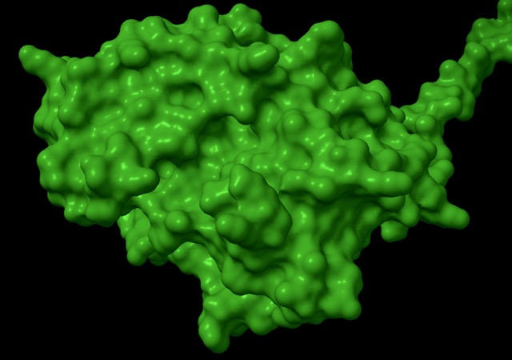
</p>


*AmpC beta-lactamase of Enterobacter cloacae generated by AlphaFold and ChimeraX*


## Motivations
We've learnt about [ESBL](https://www.kenkoonwong.com/blog/amr/) and [CRE](https://www.kenkoonwong.com/blog/cre/). Let's explore AmpC mechanics. This is going to be interesting because it's not a straightforward constitutive gene that produces via plasmid. It contains downstream mechanics that controls (aka repress) the AmpC gene (in chromosome). Let's take a look ourselves! Here we will also use some associative terms that we understand to solidify our understanding and the actual mechanics. Let's go!

#### Disclaimer
*I am not a microbiologist. This is purely for educational purpose. Also, please take note that my lingo preference of AmpG (Gatekeeper), AmpD (Dumpster), AmpR (Repressor) is purely for my own memory association and its function, not a true scientific label. If some of them are as such, it's pure coincidence.*

## Objectives:
- [How Is AmpC So Different From Other Beta-lactamase Genes?](#ampc)
  - [Let's Take A Look At NCBI](#ncbi)
- [What Are The Typical Organisms Of Clinical Significance?](#organisms)
  - [Why Is It That Serratia marcescens Not a High Risk for AmpC?](#serratia)
  - [Let's Look At Ecoli](#ecoli)
- [Cefepime and AmpC Beta-Lactamase](#cefepime)
- [What Does It Mean That Cefepime Is A Weak AmpC Inducer?](#cefepime-inducer)
- [How Similar Are The Genes for AmpG/D/R Between Species?](#similarity)
  - [AmpG](#ampg)
  - [AmpD](#ampd)
  - [AmpR](#ampr)
  - [Interpretation](#interpretation)
- [Oppotunities For Improvement](#opportunities)
- [Lessons Learnt](#lessons)

## How Is AmpC So Different From Other Beta-lactamase Genes? {#ampc}
This is an interesting bit about class C beta-lactamase AmpC, even though the gene exists, it's actually repressed and regulated by a few other genes. Let's take a look. 

`AmpG` : inner membrane permease that transports anhydromuropeptides (cell wall breakdown products) from the periplasm into the cytoplasm. So, let's say beta lactam antibiotic increases the cell wall breakdown, we get a lot of these products. This protein then transports these prodcuts into cytoplasm. To remember all these code words, let's think of `AmpG` as `gatekeeper`.

`AmpD` : cytoplasmic amidase that recycles these anhydromuropeptides back into the cell wall synthesis pathway. Wow, it's a recycler! Let's think of `AmpD` as `dumpster`.

`AmpR` : transcriptional regulator that controls ampC gene expression, but when it binds anhydromuropeptides, it switches from a repressor to an activator. So, it's a switch that can turn on ampC production when it senses the signal of cell wall stress (the anhydromuropeptides). Just imagine that if there is an increase in cell wall destruction, our `AmpD` cannot efficiently recycler all those byproducts, these byproducts then are able to bind to `AmpR`, hence essentially turning `AmpR` into an activator and hence `AmpC` beta-lactamase would be transcribed. Let's think of `AmpR` as `repressor`.

The above natural mechanics is called `induction`, which is a reversible process. When you remove the antibiotic, the cell wall stress goes away, `AmpD` can catch up with recycling, the anhydromuropeptides are cleared, `AmpR` returns to repressor mode, and `AmpC` production stops. There is another mechanics that involves mutation of `AmpD`, rendering it useless in recycling, or mutation of `AmpR`, rendering it permanently in activator mode. This is called `derepression`, which is an irreversible process. The mutation is in the DNA, and it's passed to all daughter cells, hence you get constitutive high-level production of `AmpC` beta-lactamase regardless of whether antibiotic is present or not. 🙌 

There is a lot of cartoons out there that help to depict the process above. Let's view one of them from [A Primer on AmpC β-Lactamases: Necessary Knowledge for an Increasingly Multidrug-resistant World](https://pmc.ncbi.nlm.nih.gov/articles/PMC6763639/)


> Note that this blog does not touch on plasmid-mediated class C beta-lactamase. We're only looking at chromosomal genes. It's important to note this because plasmid-mediated AmpC can be transferred between organisms, whereas chromosomal AmpC is generally not transferable and is regulated by the host's genetic machinery. In other words, there is usually no proteins that repress the expression of plasmid-mediated AmpC, hence the presence of plasmid-mediated AmpC is usually associated with high level of beta-lactam resistance. Whereas with chromosomal AmpC, the presence of the gene does not necessarily mean high level of beta-lactam resistance, because it may be repressed and regulated by the host's genetic machinery. 

Look at [IDSA AMR Guideline 2024 Section 2: AmpC β-Lactamase-Producing Enterobacterales](https://www.idsociety.org/practice-guideline/amr-guidance/) for other references of why these bacteria produce AmpC beta lactamase and the types. Very informative! From clinical standpoint, the derepressed AmpC (mutation of AmpD or AmpR where AmpC gene is always activated) or plasmid-mediated AmpC will usually prefer itself phenotypically, hence we usually would know from susceptibility testing. The tricky part is the inducible portion, because phenotypically it will show that it is ceftriaxone susceptible, but when ceftriaxone is used, it will induce AmpC beta lactamase production rendering ceftriaxone resistance. Though we don't have to worry too much of this nowadays because most lab would automatically hide these antibiotics regardless of the susceptibility. 🙌 Maybe not in uncomplicated UTI isolates? But, we have to beware that basal production of AmpC beta-lactamase renders these organisms intrinsically resistant to ampicillin, amoxicillin-clavulanate, and 1st and 2nd generation cephalosporins.

### Let's Take A Look At NCBI {#ncbi}
Alright, now that we've got some basics of the regulatory mechanisms, let's look at where to find the actual genes in NCBI.

1. Go to [NCBI Genome](https://www.ncbi.nlm.nih.gov/datasets/genome/).    
2. Look for `Enterobacter cloacae`.     
3. Select the [reference gene](https://www.ncbi.nlm.nih.gov/datasets/genome/GCF_905331265.2/)
4. Select [View Annotated Genes](https://www.ncbi.nlm.nih.gov/datasets/gene/GCF_905331265.2).     
5. On filter, type "amp". And we'll see.     

<p align="center">
  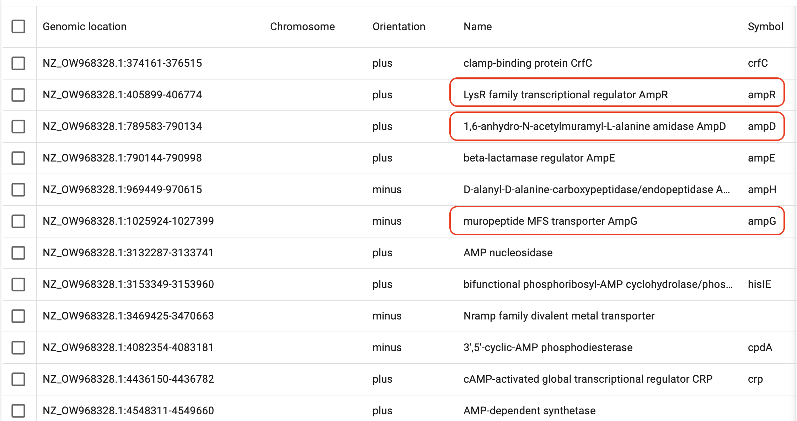
</p>

Alright! All those `AmpG (Gatekeeper), AmpD (Dumppster), AmpR (Repressor)` protein genes are there! 🙌 Now let's take a look at `AmpC Beta Lactamase` by looking for `lactamase`. 
  
<p align="center">
  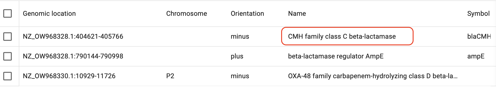
</p>

Notice that it didn't say `ampC` but this is the class C beta-lactamase that comes with reference E. cloacae. 

Also, note that Usually the AmpC beta-lactamase gene is adjacent to AmpR gene and in opposite direction. Take a look at their position and orientation. 🤔 The end of CMH class C beta lactamase is 405766, the beginning of AmpR is 405899. And their orientations are opposite as well! 🙌 Let's take a look at another Enterobacter cloacae complex. 

Looking at [Enterobacter asburiae](https://www.ncbi.nlm.nih.gov/datasets/gene/GCF_007035805.1/?search=amp). 

<p align="center">
  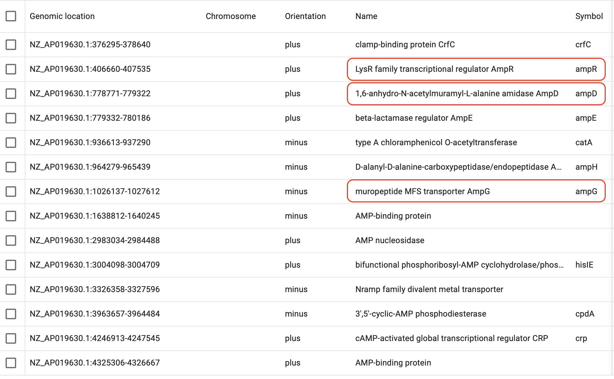
</p>

<p align="center">
  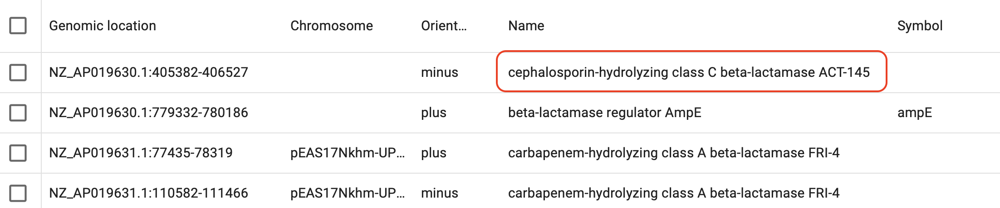
</p>

Notice the Ampc-AmpR positions and orientation? Same same? 🙌

## What Are The Typical Organisms Of Clinical Significance? {#organisms}
According [IDSA AMR Guidelines](https://www.idsociety.org/practice-guideline/amr-guidelines/), `Enterobacter cloacae complex, Klebsiella aerogenes, and Citrobacter freundii` (we'll call it the big 3) are the most common Enterobacterales at moderate risk for clinically significant inducible AmpC production. Clinical reports suggest that the emergence of resistance after exposure to an agent like ceftriaxone may occur in approximately 20% of infections caused by these organisms. Other organisms such as Serratia marcescens, Morganella morganii, and Providencia spp., are significantly less likely to overexpress ampC based on both in vitro analysis. Other less common pathogen such as Hafnia alvei, Citrobacter youngae, Yersinia enterocolitica that carry inducible chromosomal ampC genes do not have too robust of data to support or refute the risk of ampC induction. 

Interestingly when reading [IDSA AMR Guidelines](https://www.idsociety.org/practice-guideline/amr-guidelines/), citrobacter koseri does not have ampC beta-lactamase, let's verify this on [NCBI](https://www.ncbi.nlm.nih.gov/datasets/gene/GCF_000018045.1/?search=lactamase). Wow, it's true! It has class A beta-lactamase, not class C! Also, we need to note that, just because certain organisms have class C beta-lactamase gene, it doesn't mean it will be overexpressed. It is also quite interesting that even with the right machinery like the big 3, it's ~20% of infections with emergence of resistance, interesting... 🤔 but why? What happened to the other 80%? Also, we'll see other examples below of other low risk organisms. 

### Why Is It That Serratia marcescens Not a High Risk for AmpC? {#serratia}
Why Serratia Marcensens has all the genes but yet not a high risk ampC depression? Apparently, [S. marcescens has 2 amidohydrolases (ampD and amiD2) and the deletion of both of these 2 is necessary for AmpC de-repression](https://pmc.ncbi.nlm.nih.gov/articles/PMC10777825/)! Two dumpster proteins! Alright, let's find it if we can! [Here](https://www.ncbi.nlm.nih.gov/datasets/gene/GCF_030291735.1/?search=amidase), they used Serratia marcescens ATCC 13880. 

<p align="center">
  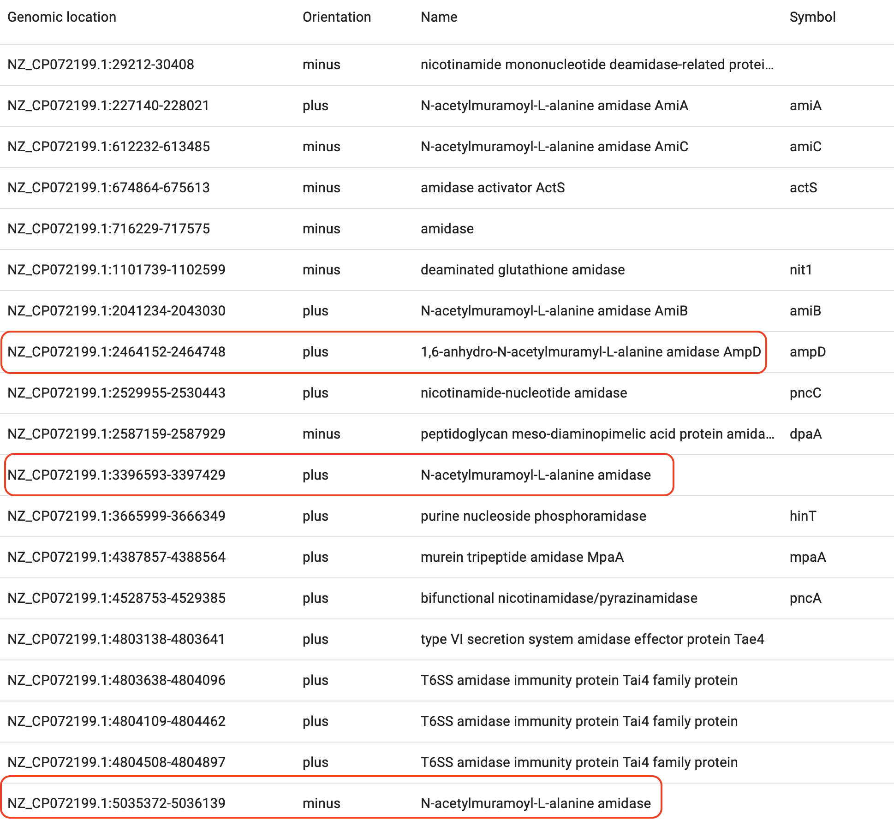
</p>

Umm, OK, we see AmpD, but there are a lot of other `amidase` and we do not see AmiD2 as stated from the paper. Highlighted in red are AmpD and amidases that were not labeled specifically, maybe it's one of them? 

Thankfully the paper provided forward and reverse primer for deletion of `amiD2`. This means that the primers are designed to exclude the `amiD2` gene. Hence, if we use the 5' primer as a forward primer, and then the 3' primer as a reverse primer, we should be able to locate the positions of `amiD2` which should be in bettween or around the vicinity. Let's see which one this is.


``` r
library(Biostrings)
library(tidyverse)

genome <- readDNAStringSet(
  "smatcc/ncbi_dataset/data/GCA_017654245.1/GCA_017654245.1_ASM1765424v1_genomic.fna"
)                                                                             
chr <- genome[1]

fwd <- DNAString("CGTAAAGTCCCTCTCTCGCT")                          
rev <- DNAString("ATGCCGAAACCGCCGCCGTT")                          
rev_rev <- reverseComplement(rev)

(fwd_hits <- vmatchPattern(fwd, chr, max.mismatch = 0))           
(rev_hits <- vmatchPattern(rev_rev, chr, max.mismatch = 0))   
```

<p align="center">
  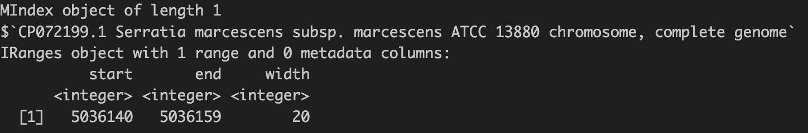
</p>
<p align="center">
  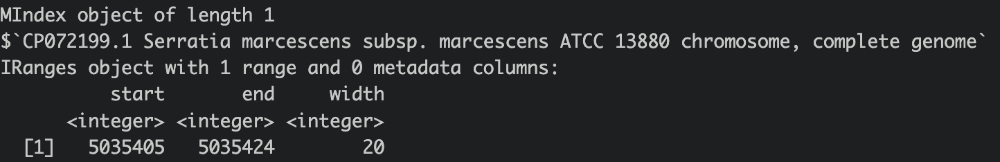
</p>

Awesome! We see that we have EXACT match for forward primer on our sequence, which makes sense because it should bind to the minus strand and move rightward to make copies away from the active gene `amiD`. Then the reverse gene should bind to plus strand (our sequence) and copy leftward. This also make sense because according to the picture above of al the annotated `amidase`. Let's interpret this, our gene should be between the higher and lower positions of these 2 patterns `5035405` and `5036140`. Alright! We do have one that is between or around this vicinity! We found it!

<p align="center">
  
</p>

Huzzah! So Serratia marcenses do have 2 recylcers! Cool! 😎 Let's use AlphaFold to visualize them side by side. Left is AmpD, right is AmiD2.

<p align="center">
  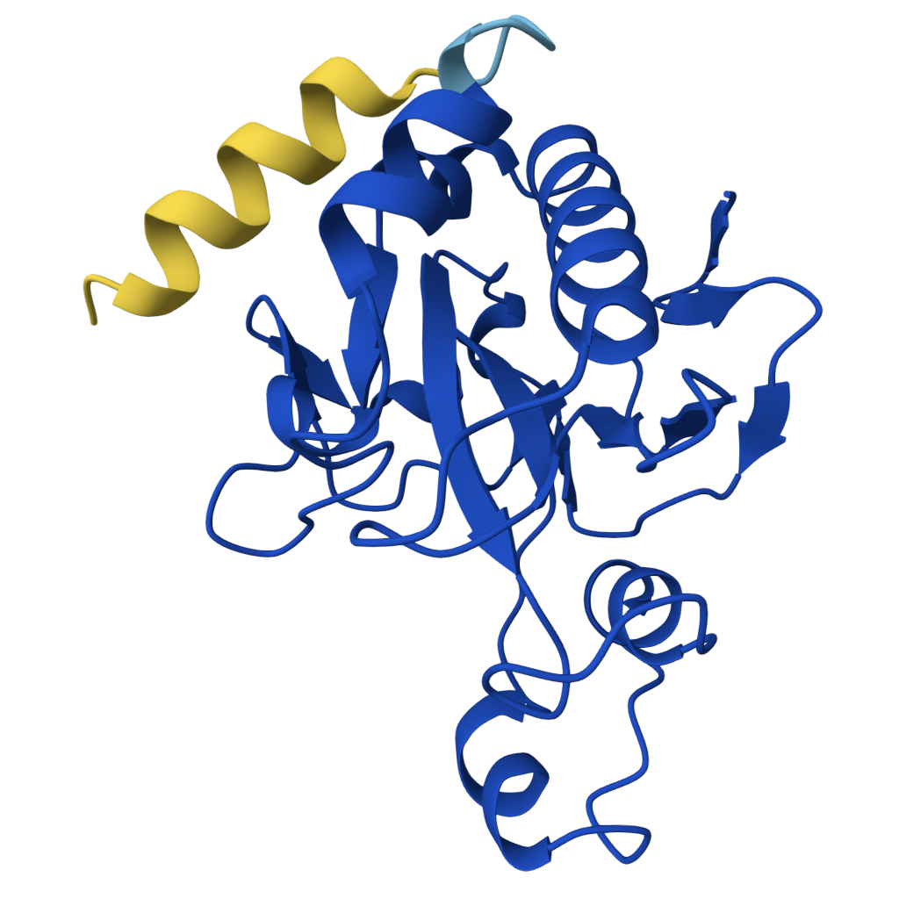
  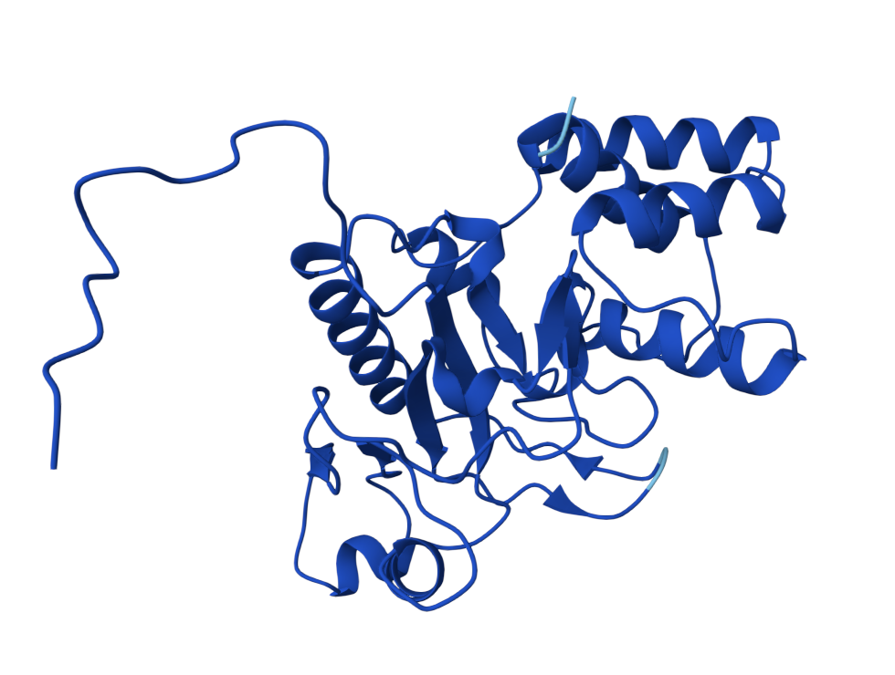
</p>

Wow, they look very different! Maybe?

> Note: After much poking around, with the help of multiple Claude chats and probes, we finally found out that the primers were actually to exclude the gene as opposed to make copies of the gene. Which makes total sense! Because the forward primer binds to the minus strand (the strand that carries the amiD2 gene) and it seems to copy rightward away from the gene. Took me a while to figure out why that is! Also, conventionally, all fasta are in plus strand. Hence we were able to use this information to identify AmiD2 gene! 🙌

Now, let's take a look at other organisms that we normally don't think of AmpC related.

### Let's Look At Ecoli {#ecoli}
Now, we've looked at Enterobacter Cloaecae complex and verified that they do have all the machinery and AmpC to produce the enzyme. What about Ecoli? It can't have it, right? Else we should be hearing more about this. Let's take a look at one of the [Ecoli reference gene](https://www.ncbi.nlm.nih.gov/datasets/gene/GCF_000005845.2/?search=amp).

<p align="center">
  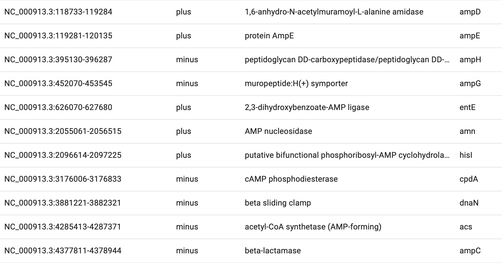
</p>

WAHTHTHAT ?! they have these genes too !?!? `AmpG`, `AmpD`, `AmpC` too !?!?! I'm so confused !!! 😵‍💫

Looking at the literature, apparently they lack `AmpR` which is the switch that turns on the production of AmpC. So, even though they have `AmpC` gene, they do not have the machinery to turn it on. Hence, they do not produce clinically significant amount of AmpC beta-lactamase. Wow! Very interesting!

## Cefepime and AmpC Beta-Lactamase {#cefepime}
Cefepime is the preferred antibiotics for AmpC producing organisms. Does that mean that there should be a low or no affinity of AmpC to Cefepime? Let's perform some molecular dynamic simulation on this! Code not documents, but approach is the same as [this](https://www.kenkoonwong.com/blog/mdsim2/) and [this](https://www.kenkoonwong.com/blog/cre/)

}}index_files/figure-html/unnamed-chunk-2-1.png" width="1152" />}}index_files/figure-html/unnamed-chunk-2-2.png" width="1152" />}}index_files/figure-html/unnamed-chunk-2-3.png" width="1152" />}}index_files/figure-html/unnamed-chunk-2-4.png" width="1152" />}}index_files/figure-html/unnamed-chunk-2-5.png" width="1152" />

}}index_files/figure-html/unnamed-chunk-3-1.png" width="672" />

Looking at all of the plots above it looks like AmpC beta-lactamase binds to Cefepime !!! 🤔 So I was wrong! Looking at the literature, in fact, AmpC beta-lactamase can bind to Cefepime and form a rather stable acyl enzyme complexes that make it relatively resistant to hydrolysis compared to other cephalosporins! Wow, how about that! This is very interesting! Also a fun learning too! Wait a minute, does that also mean it occupies the AmpC Beta-lactamases rendering them inactivate against other cephalosporins !?! Unfortunately not, these bonds will eventually undergo deacylation making the enzymes free again for binding. Also Cefepime is a weak AmpC inducer. What does that actually mean? 

## What Does It Mean That Cefepime Is A Weak AmpC Inducer? {#cefepime-inducer}
This means that Cefepime is less likely to trigger the induction of AmpC beta-lactamase production compared to other cephalosporins. Does that mean whatever mechanism cefepime acts on the cell wall, with whatever downstream effect to have less products that trigger AmpR derepression? [Does antibiotics affecting PBP4 has anything to do with this? ](https://pubmed.ncbi.nlm.nih.gov/25495032/) Cefepime acts on PBP1-4, could that be why it's a weak inducer? 🤷‍♂️ What do you think? 
  
## How Similar Are The Genes for AmpG/D/R Between Species? {#similarity}
You know how when we assess CTX-M-15, KPC-1, they all share the same nucleotide sequence and hence we can perform exact match on any bacteria to see if they possess such genetic element? I wonder if that's the case for AmpG, AmpD, AmpR? Or do they have different sequences in different organisms? Let's look at heatmap.

<details>
<summary>sample code</summary>

``` r
library(pwalign)

gene <- c("ampG","ampD","ampR")

for (gene_i in gene) {
ampd <- readDNAStringSet(paste0(gene_i".fasta"))
  mat <- matrix(0, nrow = 13, ncol = 13)
  for (i in 1:13) {
    for (j in 1:13) {
      pair <- pairwiseAlignment(ampd[i], ampd[j])
      mat[i,j] <- pair@score
    }
  }
  
  rownames(mat) <- names(ampd)
  colnames(mat) <- names(ampd)
  heatmap(mat, symm = T)
}
```
</details>

### AmpG {#ampg}
<p align="center">
  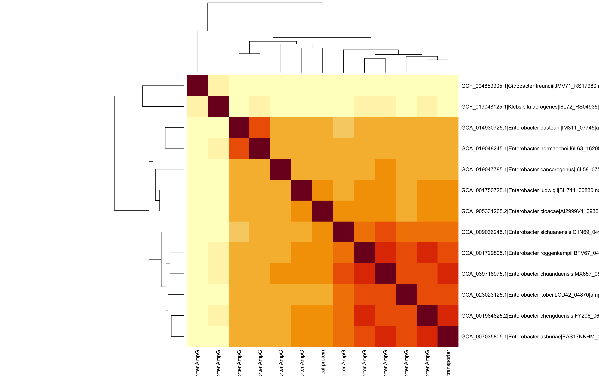
</p>


### AmpD {#ampd}
<p align="center">
  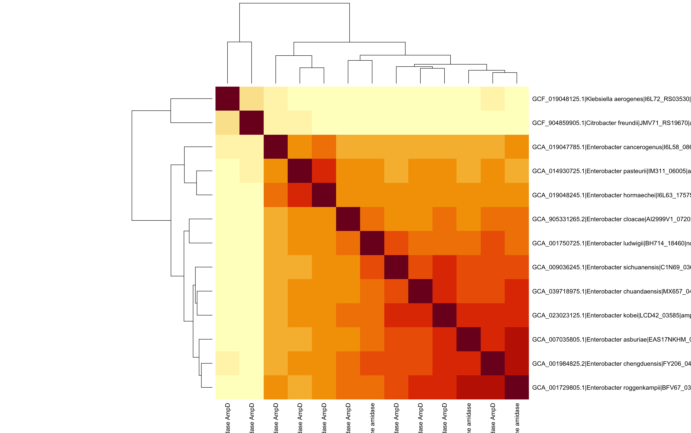
</p>

### AmpR {#ampr}
<p align="center">
  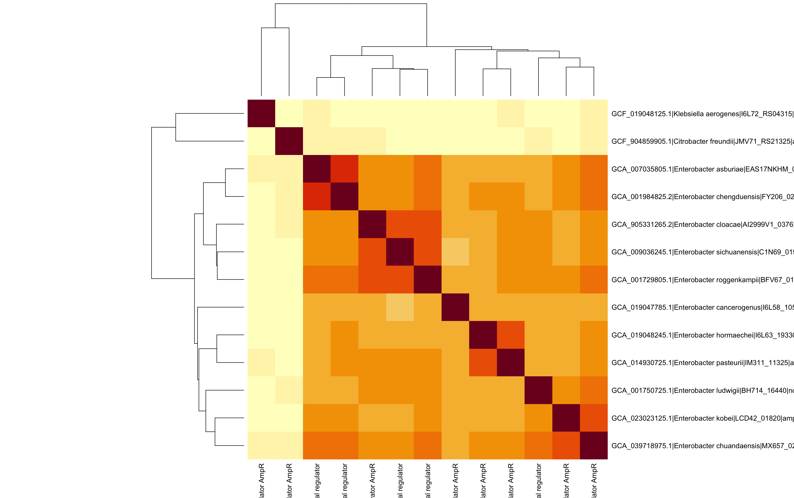
</p>

### Interpretation {#interpretation}
Wow, they are in fact very different! Let's focus on cloacae and ludwigii. They appear to cluster together on AmpG and AmpD, but look at AmpR, they are not! We can genus clusters together, citrobacter freundii and klebsiella aerogenes are closer to each other than enterobacter cloacae complex. Even if they are close, they're relatively far apart. This is fascinating because even though they are labeled as the same protein (e.g. AmpG), they are different in nucleotides! This means that if we want to do an exact match for AmpG, we may not be able to use the same sequence for different organisms. We may have to use different sequences for different organisms. And of course, this includes AmpC beta lactamases. This is very interesting! This also means that if we're attempting to locate or annotate such protein producing genes, we need species specific reference and can't just pull an off the shelf sequence for annotation or detection. Very different from our prior plasmids experiences.

  
## Opportunities For Improvement {#opportunities}
- learn about AmpE, AmpH, AmpF?
- learn about porin mutation next
- learn the different type of PBPs and the antibiotics that bind to them and which organisms contain these PBPs.
  
## Lessons learnt {#lessons}
- apparently some AmpR genes were not annotated as such, but it seems like majority are adjacent to ampC gene.
- learnt how to put image side by side
- learnt the direction of forward and reverse primers
- AmpC beta-lactamase can bind to Cefepime and form a rather stable acyl enzyme complexes that make it relatively resistant to hydrolysis compared to other cephalosporins
- learnt citrobacter koseri doesn't actually possess class C beta-lactamase!
- learnt Serratia marsecens has 2 recyclers (AmpD and AmiD2)!
- learnt AmpC mechanics and its genes/proteins are species specific if we want to detect or annotate.


If you like this article:
- please feel free to send me a [comment or visit my other blogs](https://www.kenkoonwong.com/blog/)
- please feel free to follow me on [BlueSky](https://bsky.app/profile/kenkoonwong.bsky.social), [twitter](https://twitter.com/kenkoonwong/), [GitHub](https://github.com/kenkoonwong/) or [Mastodon](https://rstats.me/@kenkoonwong)
- if you would like collaborate please feel free to [contact me](https://www.kenkoonwong.com/contact/)
